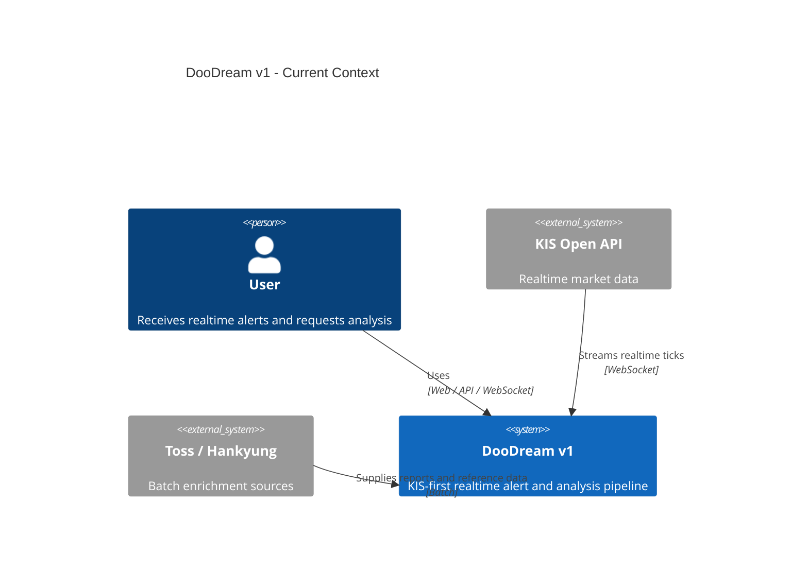
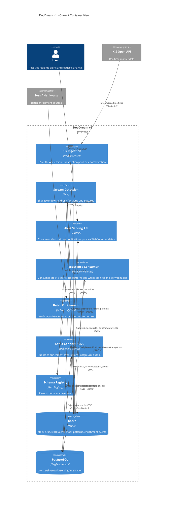
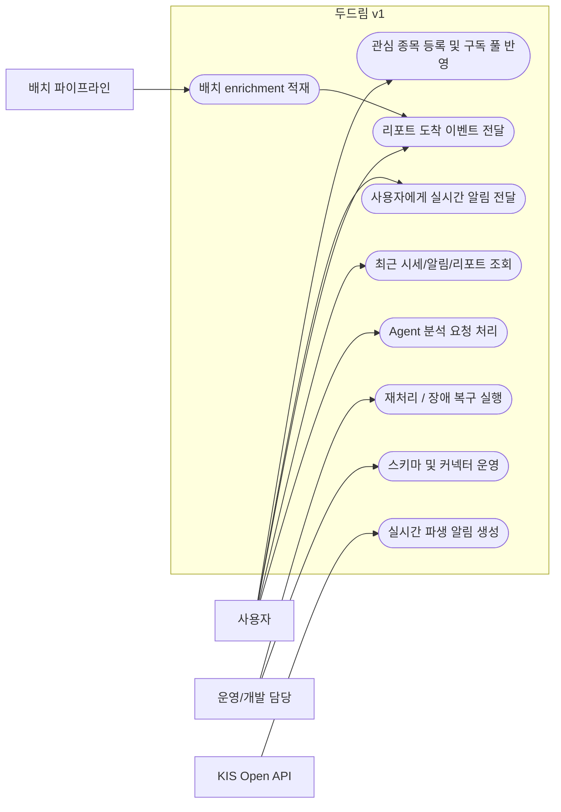
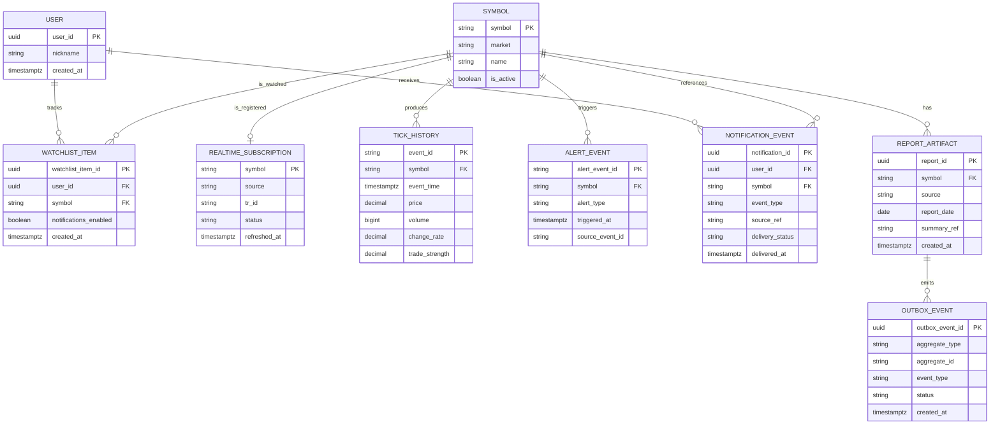

---
aliases:
tags:
created: 2026-04-29 02:37:46
---

# 11 Design Freeze Discussion Pack

내일 동료 논의를 위한 v1 설계 확정 문서다. 기존 `01`~`10` 문서 중 현재 범위와 충돌하는 내용이 있으면, **이 문서와 [[event-driven-stock-pipeline]]를 우선**한다.

## Freeze Summary

- v1 범위는 **한국시장 41종목 실시간 분석/알림 파이프라인**까지다.
- 저장소는 **단일 PostgreSQL**로 단순화한다. BigQuery / Elasticsearch는 v1 범위에서 제외한다.
- 실시간 backbone은 **KIS WebSocket -> Kafka -> Flink -> Kafka -> FastAPI alert-service -> PostgreSQL / WebSocket**이다.
- **실시간 소스는 KIS only**로 고정한다. Toss / 리포트 / 재무 데이터는 배치 enrichment 경로로만 다룬다.
- 이벤트 계약은 처음부터 **Avro + Schema Registry**로 간다.
- Kafka Connect는 **Debezium Source 중심**으로 사용하고, `stock-ticks` / `stock-patterns` 적재는 **우리가 만드는 custom consumer**로 처리한다.
- Agent/MCP의 조회 경로는 **PostgreSQL only**다. Kafka direct read는 하지 않는다.
- **Paper trading / 주문 실행 / 미장 확장**은 현재 설계 확정 범위에서 제외한다.

## Detailed Spec Map

- [[12-kis-realtime-ingress-design]] — KIS 인증, WebSocket, subscription pool, raw payload parsing, `stock-ticks` handoff
- `13-stream-detection-design.md` — Flink window / alert / pattern scope (planned)
- `14-alert-serving-design.md` — alert-service / notification / WebSocket scope (planned)
- `15-batch-enrichment-design.md` — Airflow / outbox / Debezium scope (planned)

## Live Sync Rule

- KIS 관련 상세 사실 변경은 **항상 `[[12-kis-realtime-ingress-design]]` 먼저 수정**한다.
- `11`은 회의용 요약과 범위 결정을 유지하고, KIS 핵심 팩트는 아래 transclusion으로 동기화한다.

![[12-kis-realtime-ingress-design#Freeze Sync Extract]]

## D2 Rendered Architecture

발표/리뷰용으로는 아래 D2 렌더 이미지를 먼저 본다. Mermaid C4는 문서 안에서 바로 수정하기 쉬운 reference 버전으로 남겨둔다.

### D2 Context View

![[exports/11-d2-context-view.svg]]

Source: [[11-d2-context-view.d2]]

### D2 Container View

![[exports/11-d2-container-view.svg]]

Source: [[11-d2-container-view.d2]]

## Readable C4 Snapshot

아래 C4는 **현재 freeze 기준 v1 아키텍처만 다시 그린 요약본**이다. 기존 `07`, `08` 문서는 historical reference로 보고, 발표/논의용으로는 이 섹션을 우선한다.

### C4 Context (current v1)

### C4 Container (current v1)

### How to read this C4

- **왼쪽에서 오른쪽**으로 보면 된다: `KIS -> ingestion -> Kafka -> Flink -> Kafka -> FastAPI -> PostgreSQL`
- batch는 별도 경로지만, outbox + Debezium으로 실시간 serving과 합류한다.
- tick / pattern DB 적재는 Connect가 아니라 **custom persistence consumer**가 담당한다.
- Agent / paper trading / BigQuery / Elasticsearch는 **이 C4에서 의도적으로 제외**했다. 현재 freeze 범위가 아니기 때문이다.

## 1. Scope 정의

### In Scope

| 영역 | 포함 범위 |
| --- | --- |
| Realtime ingress | KIS WebSocket 기반 41종목 구독, tick 파싱/정규화, Kafka `stock-ticks` 발행 |
| Stream processing | Flink 기반 5분 슬라이딩 윈도우, CEP, `stock-alerts` / `stock-patterns` 발행 |
| Serving | FastAPI alert-service의 Kafka consume, DB 저장, WebSocket push |
| Batch enrichment | Toss / Hankyung 등 비실시간 소스를 Airflow -> PostgreSQL로 적재하고, outbox -> Debezium -> `enrichment-events`를 발행 |
| Read layer | PostgreSQL 기반 관심종목, 최근 알림, 리포트 요약, Agent 조회 API |
| Reliability | acks=all, idempotent producer, read_committed consumer, DB upsert 기반 멱등 처리 |

### Out of Scope

| 영역 | 제외 이유 |
| --- | --- |
| Paper trading / 주문 엔진 | 학습 프로젝트 기준 범위 과대. 현재는 분석/알림 파이프라인이 핵심 |
| BigQuery / Elasticsearch serving | 단일 PostgreSQL 전략과 충돌 |
| Kafka Streams 도입 | Flink + FastAPI 분리 원칙으로 대체 가능 |
| Agent의 Kafka direct access | CQRS read path를 PostgreSQL로 고정 |
| Toss 기반 실시간 ingress | 실시간 경로는 KIS WebSocket으로 고정 |
| 미국시장(Finnhub 등) 실제 구현 | 추상화만 설계하고 구현은 후순위 |
| 전종목 실시간 커버리지 | KIS 41종목 한도 때문에 현재 구조상 불가 |

### Scope Statement

두드림 v1은 **한국시장 41종목을 서비스 단위 구독 풀로 관리하면서, 실시간 tick을 이벤트 파이프라인으로 처리해 사용자에게 알림과 분석 컨텍스트를 제공하는 시스템**으로 정의한다.

## 2. 기능적 / 비기능적 요구사항 정의

### 기능적 요구사항

| ID    | 요구사항                                                                                                |
| ----- | --------------------------------------------------------------------------------------------------- |
| FR-01 | 시스템은 KIS WebSocket으로 서비스 전체 기준 최대 41종목을 실시간 구독할 수 있어야 한다.                                           |
| FR-02 | kis-ws-bridge는 KIS raw payload를 정규화하여 `stock-ticks` 토픽에 발행해야 한다.                                    |
| FR-03 | Flink는 `stock-ticks`를 소비해 5분 슬라이딩 윈도우 지표와 CEP 규칙을 계산해야 한다.                                          |
| FR-04 | 시스템은 `PRICE_ALERT`, `VI_IMMINENT`, `MOMENTUM_SHIFT`, `TRADING_HALT` 유형의 알림 이벤트를 발행해야 한다.            |
| FR-05 | 시스템은 골든/데드크로스, RSI, MACD 기반 패턴 이벤트를 `stock-patterns`로 발행할 수 있어야 한다.                                 |
| FR-06 | alert-service는 `stock-alerts`와 `enrichment-events`를 소비해 PostgreSQL에 저장하고 사용자에게 WebSocket으로 전달해야 한다. |
| FR-07 | Toss / Hankyung 등 비실시간 소스는 Airflow에서 PostgreSQL로 직접 적재하고, 사용자 알림이 필요한 경우 outbox에 기록해야 한다.           |
| FR-08 | Debezium은 outbox를 CDC하여 `enrichment-events`를 Kafka에 발행해야 한다.                                        |
| FR-09 | 사용자/Agent 조회는 PostgreSQL만 조회해야 하며 Kafka를 직접 읽지 않아야 한다.                                              |
| FR-10 | 시스템은 replay와 장애 복구를 위해 tick 이력을 재처리 가능한 형태로 보존해야 한다.                                                |

### 비기능적 요구사항

| ID     | 항목     | 정의                                                                                                         |
| ------ | ------ | ---------------------------------------------------------------------------------------------------------- |
| NFR-01 | 실시간성   | 장중 사용자 체감 기준 초 단위 전달을 목표로 한다. v1 토론 기준은 "수 초 내 알림 도착"이다.                                                   |
| NFR-02 | 내구성    | Broker는 `replication.factor=3`, `min.insync.replicas=2`, `unclean.leader.election.enable=false`를 기본값으로 한다. |
| NFR-03 | 멱등성    | Producer는 `acks=all`, `enable.idempotence=true`를 사용하고, consumer side effect는 DB upsert로 멱등 처리한다.           |
| NFR-04 | 일관성    | Consumer는 `enable.auto.commit=false`, `isolation.level=read_committed`를 사용한다.                              |
| NFR-05 | 스키마 진화 | 이벤트는 Avro + Schema Registry를 사용하고 backward compatible 변경만 허용한다.                                            |
| NFR-06 | 운영 단순성 | 학습 프로젝트이므로 단일 PostgreSQL과 제한된 토픽 수를 유지하고, 불필요한 저장소/서비스 증설은 금지한다.                                           |
| NFR-07 | 비용 제약  | 로컬/kind 우선, 클라우드 배포는 후순위다. 상시 클라우드 운영비는 토론 기준 최소화한다.                                                       |
| NFR-08 | 관측성    | 최소 수준의 lag, connector status, checkpoint 상태, WebSocket 연결 상태를 확인할 수 있어야 한다.                                |
| NFR-09 | 보안     | KIS 키는 Secret으로 관리하고, 프론트엔드와 Agent에 Kafka 접근 권한을 주지 않는다.                                                   |
| NFR-10 | 확장성    | 현재는 한국시장 전용이지만 `MarketDataSource` 추상화와 `source` 필드로 미장 확장 가능성을 남긴다.                                        |

## 3. Usecase 다이어그램

### 핵심 Usecase 설명

| Usecase | 설명 | 주 컴포넌트 |
| --- | --- | --- |
| 관심 종목 등록 및 구독 풀 반영 | 유저 watchlist를 서비스 전체 구독 풀과 분리해 관리 | FastAPI, PostgreSQL, subscription manager |
| 실시간 파생 알림 생성 | tick을 윈도우/CEP 처리해 alert/pattern 이벤트 생성 | kis-ws-bridge, Kafka, Flink |
| 사용자에게 실시간 알림 전달 | alert-service가 DB 저장 후 WebSocket push | FastAPI alert-service, PostgreSQL |
| 리포트 도착 이벤트 전달 | 배치 enrichment 완료를 outbox + Debezium으로 이벤트화 | Airflow, PostgreSQL, Debezium |
| Agent 분석 요청 처리 | Agent는 PostgreSQL에서 recent context를 읽고 답변 | Agent runtime, FastAPI, PostgreSQL |
| 재처리 / 장애 복구 실행 | tick history 기반 replay 및 consumer 재기동 | Kafka, PostgreSQL, runbook |

## 4. ER 다이어그램 -> DB schema, Event schema

### ER 다이어그램

### DB schema 제안

| 스키마 | 테이블 | 역할 |
| --- | --- | --- |
| `serving` | `users`, `watchlist_items`, `notification_events`, `symbol_snapshot` | 사용자 조회와 Agent read path |
| `bronze` | `tick_history` | JDBC Sink가 적재하는 append-only tick 저장소. replay 기준 데이터 |
| `silver` | `symbol_5m_metrics`, `report_artifacts` | 윈도우 지표와 배치 enrichment 결과 |
| `gold` | `alert_events`, `pattern_events` | 사용자에게 의미 있는 파생 이벤트 저장 |
| `integration` | `realtime_subscriptions`, `outbox_events` | KIS 등록 상태와 CDC outbox 관리 |

### DB schema 설계 원칙

- `bronze.tick_history`는 Kafka `stock-ticks`의 저장본이며 사실상 archive 역할을 겸한다.
- `gold.alert_events`와 `serving.notification_events`는 분리한다. 전자는 도메인 이벤트 저장, 후자는 유저 전달 상태 저장이다.
- `integration.realtime_subscriptions`는 "유저 watchlist"가 아니라 **서비스 전체 구독 풀**을 나타낸다.
- Agent 조회용 스냅샷은 `serving.symbol_snapshot`에서 제공하고, Kafka를 직접 읽지 않는다.

### Event schema 제안

#### 공통 Envelope

| 필드 | 설명 |
| --- | --- |
| `event_id` | 전역 고유 ID |
| `event_type` | `stock.tick.v1`, `stock.alert.v1` 등 |
| `event_version` | Avro schema version |
| `source` | `kis`, `batch-enrichment` 등 |
| `symbol` | 종목 코드 |
| `occurred_at` | event time |
| `trace_id` | 추적/디버깅용 correlation id |

#### 토픽별 스키마

| Topic | Key | Value 핵심 필드 | Producer | Consumer |
| --- | --- | --- | --- | --- |
| `stock-ticks` | `symbol` | `source`, `source_tr_id`, `market`, `trade_time`, `raw semantic field set (KIS realtime tick body)`, `schema_version` | kis-ws-bridge | Flink, custom persistence consumer |
| `stock-alerts` | `symbol` | `alert_type`, `window_start`, `window_end`, `trigger_values`, `source_tick_event_id` | Flink | alert-service |
| `stock-patterns` | `symbol` | `pattern_type`, `window_start`, `window_end`, `trigger_values`, `strategy_name` | Flink | custom persistence consumer, analysis consumers |
| `enrichment-events` | `symbol` or `report_id` | `report_id`, `report_type`, `available_at`, `summary_ref`, `delivery_target` | Debezium | alert-service |

### Event schema 원칙

- 포맷은 **Avro + Schema Registry**를 기본으로 한다.
- backward compatible 변경만 허용한다.
- `stock-ticks`는 v1에서 **KIS-oriented raw handoff contract**로 두고, source-specific semantic field를 그대로 실을 수 있다.
- alert / pattern payload는 `trigger_values`에 집계값을 함께 담아 self-descriptive하게 발행한다.
- Debezium과 JDBC Sink를 같이 운영하므로, 처음부터 schema naming/versioning 규칙을 통일한다.

### DB write path summary

| Topic / Event | DB write path | Target table(s) | 이유 |
| --- | --- | --- | --- |
| `stock-ticks` | custom persistence consumer | `bronze.tick_history` | KIS raw-oriented tick handoff를 그대로 저장하고, 보정/표준화는 이후 단계에서 결정하기 위해서 |
| `stock-alerts` | FastAPI `alert-service` custom consumer | `gold.alert_events`, `serving.notification_events` | DB 저장 + WebSocket push + 유저 전달 상태 관리가 함께 필요하다 |
| `stock-patterns` | custom persistence consumer | `gold.pattern_events` | pattern 저장도 동일 consumer 계열에서 제어해 schema / validation / replay 규칙을 맞춘다 |
| `enrichment-events` | FastAPI `alert-service` custom consumer | `serving.notification_events` 또는 리포트 도착 상태 테이블 | 유저 알림 / push 로직이 들어가므로 serving consumer가 맡는다 |

### Clarification

- **tick 데이터는 우리가 만드는 custom persistence consumer로 DB에 적재한다.**
- v1의 `stock-ticks`는 normalized domain event보다 **KIS-oriented raw handoff contract**에 가깝게 본다.
- 따라서 downstream은 당분간 KIS semantic field를 직접 읽는 것을 허용한다.
- **pattern 이벤트도 같은 계열의 custom persistence consumer로 `gold.pattern_events`에 적재한다.**
- custom consumer는 현재 기준으로 **`stock-alerts` + `enrichment-events`를 처리하는 `alert-service`**에 집중한다.
- 즉 v1의 consumer 계층은 `alert-service`와 `persistence consumer` 두 종류로 본다.

## 5. 리스크 / 제약사항

| 항목 | 영향 | 대응 방안 |
| --- | --- | --- |
| KIS 41종목 한도 | 서비스 전체 구독 풀이 41종목에서 막힘 | v1 범위를 41종목으로 고정하고, watchlist와 realtime subscription pool을 분리한다. |
| KIS 앱키당 1세션 | 다중 세션 확장이 즉시 어렵다 | 단일 appkey/세션 운영을 기본으로 하고, 확장은 차후 appkey 추가 전략으로 푼다. |
| WebSocket approval key / access token 24시간 주기 | 키 갱신 실패 시 장중 수집 중단 위험 | 접속키/토큰 refresh runbook과 만료 전 갱신 로직을 우선순위 높은 운영 과제로 둔다. |
| 인프라 비용 | Kafka + Connect + Schema Registry + Flink 조합이 학습 프로젝트치고 무겁다 | 토픽 수를 최소화하고, 로컬/kind 중심으로 개발 후 필요한 시점에만 상시 배포한다. |
| 팀 역량 | CDC, Flink checkpoint, Kafka consumer 멱등 처리에 학습 비용이 크다 | 역할을 ingestion / stream / serving으로 분리하고, 각 영역의 done definition을 좁게 잡는다. |
| 단일 PostgreSQL | 저장소 SPOF이며 hot path와 read path가 한 DB에 모인다 | v1에서는 단순성을 우선하고, 테이블/스키마 분리와 retention 정책으로 버틴다. |
| 문서-설계 불일치 | 기존 C4 문서에는 BQ/ES/paper trading이 남아 있어 회의에서 혼선이 생길 수 있다 | 이 문서를 freeze note로 사용하고, 후속으로 01~10 문서를 현재 설계에 맞게 정리한다. |

## 6. 역할 분담

### 3트랙 권장안

| 트랙 | 책임 범위 | 주요 산출물 |
| --- | --- | --- |
| Track A. Ingestion / Platform | KIS 연결, parser, Kafka topic, Schema Registry, persistence consumer, subscription pool | kis-ws-bridge, topic/schema 정의, persistence consumer, Debezium 설정 |
| Track B. Stream / Data | Flink 윈도우/CEP, alert/pattern 규칙, replay 기준 데이터 정리 | Flink job, alert/pattern event contract, tick replay 기준 |
| Track C. Serving / Product | alert-service, PostgreSQL serving schema, WebSocket push, Agent read API | FastAPI alert-service, notification 저장/전달, user-facing query path |

### 공통 책임

| 영역 | 공통 규칙 |
| --- | --- |
| 계약 관리 | Avro schema PR은 Track A + B가 함께 본다. |
| 장애 대응 | 장중 장애 runbook은 Track A + C가 함께 준비한다. |
| 데모 품질 | 최종 시연 스토리는 Track B + C가 함께 정리한다. |

### 회의용 포인트

- 인원 2명이면 Track A+B를 묶고, Track C를 별도로 둔다.
- 인원 3명 이상이면 각 트랙 1명 오너를 두고, 나머지는 문서/테스트를 지원한다.
- 역할 분담 기준은 "기술 스택"보다 **장애 지점의 책임 분리**에 둔다.

## 7. 로드맵

| Phase | 기간 가정 | 목표 | Exit Criteria |
| --- | --- | --- | --- |
| Phase 0. Design Freeze | 이번 주 | scope, schema, 역할, roadmap 합의 | 이 문서 기준으로 팀 합의 완료 |
| Phase 1. Realtime Foundation | 1주 | KIS -> Kafka -> PostgreSQL 적재 경로 확보 | `stock-ticks` 발행, JDBC Sink 적재, 41종목 구독 풀 동작 |
| Phase 2. Stream Detection | 1주 | Flink alert/pattern 생성 | `stock-alerts` / `stock-patterns`가 테스트 데이터로 안정 발행 |
| Phase 3. Serving & Notification | 1주 | alert-service, WebSocket push, notification 저장 | 사용자에게 실시간 알림과 리포트 도착 알림 전달 가능 |
| Phase 4. Batch Integration | 1주 | Airflow enrichment + outbox + Debezium 연결 | `enrichment-events`가 실시간 서빙 경로와 연결됨 |
| Phase 5. Reliability Polish | 1주 | replay, idempotency, 운영 문서 보강 | 재처리 시나리오와 장애 대응 runbook 검증 완료 |

### 우선순위 원칙

1. **파이프라인 완성**이 UI 고도화보다 우선이다.
2. **신뢰성 확보**가 기능 추가보다 우선이다.
3. 미장 확장, Redis 중간 계층, 전용 이벤트 게이트웨이는 모두 v1 이후로 미룬다.

## Discussion Checklist

- 41종목을 어떤 기준으로 subscription pool에 넣고 뺄 것인가?
- `stock-patterns` MVP 범위를 어디까지 둘 것인가: 골든/데드크로스만 먼저, RSI/MACD는 후속으로 둘 것인가?
- persistence consumer를 하나로 둘지, tick / pattern용으로 분리할지?
- `serving.symbol_snapshot`를 누가 갱신할지: alert-service vs 별도 consumer?
- Debezium 범위를 "report ready"까지만 둘지, silver enrichment 전체로 넓힐지?
- 로컬 개발과 데모 환경을 어디까지 동일하게 맞출지?

## Related Notes

- [[12-kis-realtime-ingress-design]]
- [[event-driven-stock-pipeline]]
- [[01-boundary-context]]
- [[02-container-view]]
- [[03-interface-map]]
- [[04-sequence-alert-detection]]
- [[05-sequence-agent-trade]] (historical, out of current v1 scope)
- [[06-sequence-user-analysis]]
- [[07-c4-context]]
- [[08-c4-container]]
- [[09-c4-component-ingestion-stream]]
- [[10-c4-component-agent-trading]] (historical, out of current v1 scope)
