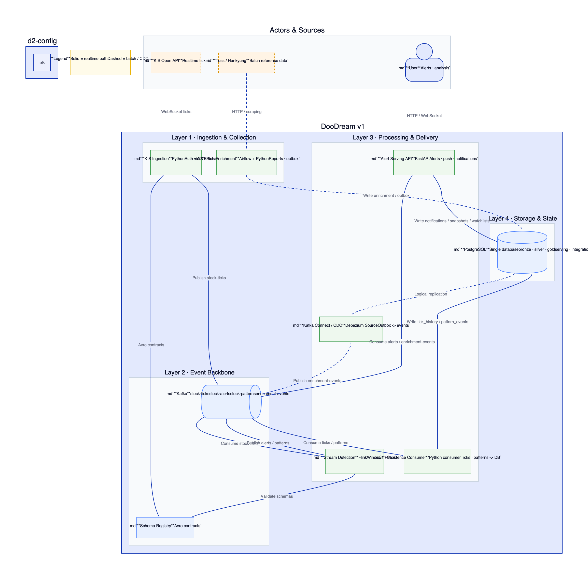

# invest_view

한국 주식 실시간 시세를 이벤트 기반으로 처리해 알림과 분석 컨텍스트를 제공하는 데이터 엔지니어링 포트폴리오 프로젝트입니다.

KIS Open API 기반 실시간 수집, Kafka/Flink 기반 이벤트 처리, FastAPI/PostgreSQL 기반 서빙 경로를 중심으로 구성되어 있습니다.

## 현재 v1 범위

- **실시간 소스**: KIS Open API only
- **대상 범위**: 서비스 단위 구독 풀 기준 최대 41종목
- **백본 구조**: KIS WebSocket -> Kafka -> Flink -> Kafka -> FastAPI -> PostgreSQL
- **저장소**: 단일 PostgreSQL (`bronze / silver / gold / serving / integration`)
- **적재 방식**: `stock-ticks`, `stock-patterns`는 custom persistence consumer로 DB 적재
- **CDC**: PostgreSQL outbox -> Debezium Source -> `enrichment-events`

## v1 범위에서 제외

- paper trading
- 미국 시장 어댑터
- BigQuery / Elasticsearch serving
- agent / frontend의 direct Kafka access

## 아키텍처 스냅샷

## 문서

- [문서 인덱스](docs/README.md)
- [설계 확정 문서](docs/design/11-design-freeze-discussion-pack.md)
- [KIS 실시간 수집 설계](docs/design/12-kis-realtime-ingress-design.md)
- [이벤트 기반 파이프라인 설계 근거](docs/design/event-driven-stock-pipeline.md)
