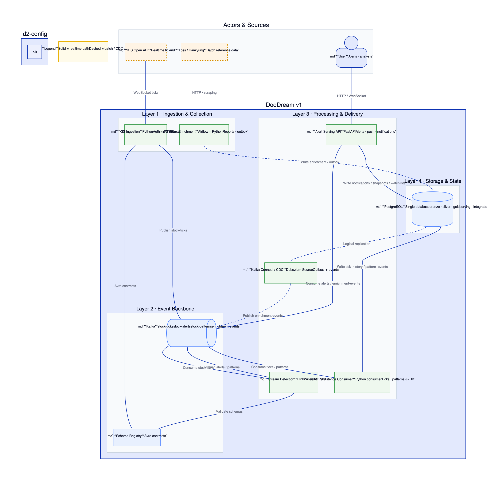

# invest_view

한국 주식 실시간 시세를 이벤트 기반으로 처리해 알림과 분석 컨텍스트를 제공하는 데이터 엔지니어링 포트폴리오 프로젝트입니다.

KIS Open API 기반 실시간 수집, Kafka/Flink 기반 이벤트 처리, FastAPI/PostgreSQL 기반 서빙 경로를 중심으로 구성되어 있습니다.

## 현재 v1 범위

- **실시간 소스**: KIS Open API only
- **대상 범위**: 서비스 단위 구독 풀 기준 최대 41종목
- **백본 구조**: KIS WebSocket -> Kafka -> Flink -> Kafka -> FastAPI -> PostgreSQL
- **저장소**: 단일 PostgreSQL (`bronze / silver / gold / serving / integration`)
- **적재 방식**: `stock-ticks`, `stock-patterns`는 custom persistence consumer로 DB 적재
- **CDC**: PostgreSQL outbox -> Debezium Source -> `enrichment-events`

## v1 범위에서 제외

- paper trading
- 미국 시장 어댑터
- BigQuery / Elasticsearch serving
- agent / frontend의 direct Kafka access

## 아키텍처 스냅샷



## 문서

- [문서 인덱스](docs/README.md)
- [설계 확정 문서](docs/design/11-design-freeze-discussion-pack.md)
- [KIS 실시간 수집 설계](docs/design/12-kis-realtime-ingress-design.md)
- [이벤트 기반 파이프라인 설계 근거](docs/design/event-driven-stock-pipeline.md)

## 운영 (Operations)

모든 인프라(Strimzi Kafka, in-cluster Schema Registry, PVC Postgres), 서비스(kis_ingestion, alert_service), Flink 작업이 단일 `kind` 클러스터(`invest-flink`) 위에서 실행됩니다. Docker Compose 및 과거의 kind↔compose 네트워크 브릿지는 더 이상 사용하지 않으며, 모든 구성요소는 in-cluster DNS(`invest-kafka-kafka-bootstrap.kafka.svc:9092`, `schema-registry:8081`, `postgres:5432`)로 통신합니다. 모든 운영 작업은 루트 `Makefile`로 수행합니다 (`make help` 참조).

### 사전 준비 (최초 1회)
```bash
kind create cluster --name invest-flink   # 클러스터 생성 (Makefile은 클러스터를 생성/삭제하지 않음)
make operators                            # Strimzi 오퍼레이터 설치
make flink-operator                       # Flink 오퍼레이터 설치 (필요 시 cert-manager 포함)
```

### 전체 스택 기동
```bash
make secrets    # 루트 .env(KIS_APP_KEY/KIS_APP_SECRET)로부터 k8s Secret 생성
make infra-up   # Kafka 클러스터 / 토픽 / Schema Registry / Postgres
make schemas    # Avro subject 등록 (stock-ticks-value, stock-alerts-value, stock-patterns-value)
make images     # kis_ingestion:qa / alert_service:qa / tick_persistence:qa / event_pattern_persistence:qa 빌드 + kind load
make apps       # alert_service / kis_ingestion / tick_persistence / event_pattern_persistence 배포
make flink      # Flink checkpoint PVC + 두 개의 FlinkDeployment 적용
make wait       # 전체 스택 Ready 대기 (infra + apps + flink)
```
실행되는 파이프라인:
- Alert path: `KIS -> Kafka(stock-ticks) -> Flink -> Kafka(stock-alerts) -> alert_service -> Postgres`
- Tick persistence: `Kafka(stock-ticks) -> tick_persistence -> Postgres(bronze/silver/serving)`
- Pattern persistence: `Flink -> Kafka(stock-patterns) -> event_pattern_persistence -> Postgres(gold)`

Flink 이미지(`stream-detection-java`) 빌드는 `bash services/stream_detection_java/scripts/deploy.sh`로 수행합니다 (mvn package + docker build + kind load — 앱 이미지 빌드 도구).

### 합성 데이터 주입 (QA)
```bash
make inject-alert    # 합성 StockAlert 1건 발행 (옵션: make inject-alert ALERT_ID=<uuid>)
make inject-tick     # 합성 StockTick 발행
```

### 종료
```bash
make down              # 앱 + flink + infra 삭제 (클러스터/오퍼레이터는 유지)
make teardown-cluster  # 위험: kind 클러스터 전체 삭제
```

### 실시간 데이터 검증
평일 장중(09:00 KST 이후) 실시간 데이터의 E2E 흐름 검증 방법은 OP-1 절차를 참조하십시오.

### OP-1: 평일 실시간 E2E 검증 (운영자 수동)

**[OPERATOR]** 이 절차는 실제 시장 데이터가 존재하는 평일 장중(09:00 KST 이후)에 운영자가 수동으로 수행합니다. 본 프로젝트의 자동화된 검증(AC-1~AC-7)은 이미 통과되었으며, 이 단계는 실제 KIS API와의 연동을 최종 확인하는 단계입니다. **Plan 완료를 차단하지 않는 비차단(non-blocking) 절차입니다.**

1. **사전 조건**
   - 전체 스택 기동 및 Ready 확인: `make wait`
   - Flink Job 상태 확인: `kubectl get flinkdeployment` (stream-detection 이 RUNNING)

2. **실시간 Tick 수신 확인**
   `kis_ingestion` 서비스의 로그를 통해 실제 시장 데이터가 유입되는지 확인합니다.
   ```bash
   kubectl logs -f deploy/kis-ingestion
   ```
   로그에 `Tick received` 또는 Kafka 발행 관련 로그가 실시간으로 흐르는지 확인합니다.

3. **Flink 처리 상태 확인**
   `kind` 클러스터에서 Flink Job이 정상 실행 중인지 확인합니다.
   ```bash
   kubectl get flinkdeployment
   ```
   `stream-detection` Job의 상태가 `RUNNING`이어야 합니다.

4. **DB Alert 생성 확인 (핵심 검증)**
   실제 시장 데이터에 의해 알림이 생성되어 DB에 적재되었는지 확인합니다.
   ```sql
   SELECT rule_name, symbol, count(*)
   FROM alert_service.alert_events
   WHERE rule_name IN ('price_alert_5min_3pct', 'vi_imminent_1pct', 'trading_halt_transition')
     AND received_at > now() - interval '1 hour'
   GROUP BY rule_name, symbol;
   ```
   *참고: `rule_name='echo'`는 진단용이므로 검증 대상에서 제외합니다.*

5. **성공 기준**
   위 SQL 쿼리 결과, 3개 규칙 중 최소 하나 이상에서 1건 이상의 데이터가 조회되어야 합니다.

### OP-2: tick persistence + pattern + serving API E2E 검증

**[OPERATOR]** 이 절차는 tick 적재, 5분봉 집계, 패턴 탐지 및 서빙 API의 데이터 흐름을 검증합니다. 실제 시장 데이터가 존재하는 평일 장중에 수행하며, **Plan 완료를 차단하지 않는 비차단(non-blocking) 절차입니다.**

1. **사전 조건**
   - 전체 스택 기동 및 Ready 확인: `make wait`
   - 서비스 상태 확인: `kubectl get deploy/tick-persistence deploy/event-pattern-persistence` (Ready)
   - Flink Job 상태 확인: `kubectl get flinkdeployment` (stream-detection 이 RUNNING)

2. **실시간 Tick 적재 확인 (Bronze)**
   `bronze.tick_history` 테이블에 데이터가 실시간으로 쌓이는지 확인합니다.
   ```bash
   kubectl exec statefulset/postgres -- psql -U postgres -d invest_view -c "SELECT count(*) FROM bronze.tick_history;"
   ```
   장중 실행 시 카운트가 지속적으로 증가해야 합니다.

3. **5분봉 집계 확인 (Silver)**
   `silver.symbol_5m_metrics` 테이블에 OHLC 데이터가 정상적으로 생성되는지 확인합니다.
   ```sql
   -- 최신 10개 5분봉 조회
   SELECT symbol, bucket_start, open, high, low, close, tick_count, is_final 
   FROM silver.symbol_5m_metrics 
   ORDER BY bucket_start DESC LIMIT 10;

   -- OHLC 불변식 검증 (결과가 0이어야 함)
   SELECT count(*) 
   FROM silver.symbol_5m_metrics 
   WHERE NOT (low <= open AND open <= high AND low <= close AND close <= high);
   ```

4. **현재 상태 스냅샷 확인 (Serving)**
   `serving.symbol_snapshot` 테이블에 종목별 최신 상태가 유지되는지 확인합니다.
   ```sql
   SELECT * FROM serving.symbol_snapshot LIMIT 10;
   ```

5. **패턴 탐지 및 Kafka 발행 확인 (Gold)**
   Flink에 의해 탐지된 기술적 패턴이 `stock-patterns` 토픽으로 발행되고 `gold.pattern_events`에 적재되는지 확인합니다.
   - **Kafka 토픽 확인**: `stock-patterns` 토픽이 존재하며 데이터가 흐르는지 확인합니다 (kcat 또는 in-cluster 클라이언트 사용).
   - **DB 적재 확인**:
     ```bash
     kubectl exec statefulset/postgres -- psql -U postgres -d invest_view -c "SELECT pattern_type, count(*) FROM gold.pattern_events WHERE triggered_at > now() - interval '1 hour' GROUP BY 1;"
     ```
   *참고: 일반 `last-state` 재배포는 패턴 상태를 보존합니다. 최초 배포 또는 명시적 state wipe 같은 cold start 직후에만 [패턴 웜업](#stateful-recovery--cold-start-pattern-warmup) 기간 동안 결과가 비어있을 수 있습니다.*

6. **통합 타임라인 및 서빙 확인 (Serving)**
   알림(Alert)과 패턴(Pattern)이 통합된 타임라인 뷰와 API 응답을 확인합니다.
   - **타임라인 뷰**:
     ```bash
     kubectl exec statefulset/postgres -- psql -U postgres -d invest_view -c "SELECT event_kind, count(*) FROM serving.symbol_signal_timeline WHERE symbol='<symbol>' GROUP BY 1;"
     ```
   - **API 응답**:
     ```bash
     # 로컬 포트 포워딩
     kubectl port-forward deploy/alert-service 8000:8000
     
     # 타임라인 데이터 조회
     curl -s localhost:8000/api/timeline/<symbol>
     ```

7. **Stateful recovery & cold-start pattern warmup**
   Flink 작업은 `last-state` 모드와 PVC 기반 checkpoint/HA 저장소(`flink-checkpoint-storage`)를 사용하므로, 일반 재배포 시 패턴 탐지 상태가 보존됩니다. 다만 최초 배포 또는 명시적 state wipe 같은 cold start 후에는 MA20, RSI, MACD 등 기술적 지표가 다시 계산되기까지 약 130분(5분봉 26개)의 장중 데이터 웜업이 필요할 수 있습니다. 이 기간 동안 `gold.pattern_events`가 비어있는 것은 정상입니다.

8. **성공 기준**
   - `bronze.tick_history` 카운트 증가.
   - `silver.symbol_5m_metrics` OHLC 불변식 통과.
   - `serving.symbol_signal_timeline`에서 alert와 pattern이 모두 조회됨.
   - API 호출 시 정상적인 JSON 데이터 반환.
