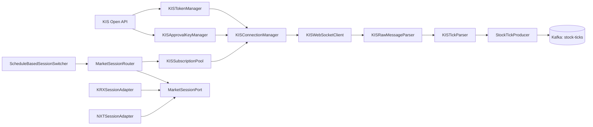

---
aliases:
tags:
created: 2026-04-29 02:53:52
---

# 12 KIS Realtime Ingress Design

이 문서는 두드림 v1의 **KIS scope 전용 상세 설계**다. 상위 의사결정은 [[11-design-freeze-discussion-pack]]를 따르되, **실시간 ingress 경계는 이 문서를 source of truth**로 본다.

## Freeze Sync Extract

- 실시간 ingress source는 **KIS only**다.
- 운영 기준은 **앱키당 1세션 / configurable subscription cap**이다. v1 기본값은 **40**으로 두고, 실제 테스트 후 조정 가능하게 한다.
- access token과 WebSocket approval key는 **분리된 lifecycle**로 관리한다.
- KIS scope의 책임은 **정규화된 `stock-ticks` 발행까지**이며, 이후 Flink/serving은 다른 scope다.

## 0. Scope Boundary

### In Scope

- KIS Open API 인증/인가 흐름 정리
- KIS WebSocket 연결/재연결/heartbeat 관리
- 서비스 단위 실시간 구독 풀 관리 (최대 41종목)
- raw payload 수신 및 파싱
- KIS raw message -> normalized tick event 변환
- Kafka `stock-ticks` 발행
- 장 상태/거래정지/VI 관련 필드 해석

### Out of Scope

- Flink 윈도우/CEP 로직
- alert / pattern 생성 규칙
- WebSocket 사용자 전달
- Toss / Hankyung batch enrichment
- Agent query path
- paper trading

### Boundary Statement

KIS scope의 책임은 **한국투자증권 Open API로부터 실시간 데이터를 안정적으로 받아, 서비스 전체 구독 풀을 관리하고, downstream이 바로 소비 가능한 정규화 이벤트를 Kafka에 발행하는 것**까지다.

## 1. Why separate this file

- 현재 `[[11-design-freeze-discussion-pack]]`는 KIS, Flink, serving, batch, reliability를 한 문서에 같이 담고 있다.
- 하지만 KIS 쪽은 외부 API 제약, 인증 수명, WebSocket 세션 관리, raw payload 해석처럼 **외부 의존성과 운영 리스크가 가장 강한 영역**이다.
- 따라서 팀 논의 기준으로는 먼저 KIS를 확정한 뒤, 이후 scope 문서를 **stream / serving / batch**로 나누는 편이 맞다.

## 2. External constraints

- 실시간 ingress는 **KIS only**다.
- KIS WebSocket은 **앱키당 1세션 / 총 41건 등록 한도**를 전제로 설계한다.
- 서비스는 다중 유저지만, KIS 구독은 **유저별이 아니라 서비스 전체 subscription pool**로 관리한다.
- REST access token은 별도 lifecycle을 가지며, WebSocket approval key와 분리해서 관리한다.
- access token / approval key는 둘 다 24시간 수명을 전제로 운영한다.
- Toss / Hankyung은 비실시간 enrichment source이며 KIS scope 밖이다.
- 전종목 실시간 커버리지는 현재 범위에서 불가능하다.

### Confirmed operational facts

| 항목 | 값 / 규칙 |
| --- | --- |
| REST token endpoint | `POST /oauth2/tokenP` |
| WebSocket approval endpoint | `POST /oauth2/Approval` |
| REST token TTL | 24시간 (`expires_in=86400`) |
| Token 재발급 특성 | 6시간 이내 재발급 시 동일 토큰 반환 패턴이 있음 |
| Approval key TTL | 24시간 |
| Approval key request field | `secretkey` 사용 (`appsecret` 아님) |
| WebSocket prod endpoint | `ws://ops.koreainvestment.com:21000` |
| WebSocket paper endpoint | `ws://ops.koreainvestment.com:31000` |
| REST current-price endpoint | `GET /uapi/domestic-stock/v1/quotations/inquire-price` |
| KRX realtime tick TR ID | `H0STCNT0` |
| KRX realtime orderbook TR ID | `H0STASP0` |
| NXT realtime tick TR ID | `H0NXCNT0` |
| NXT realtime orderbook TR ID | `H0NXASP0` |
| WebSocket transport | `ws://` plain-text (public realtime channel) |

### Known ambiguity to carry forward

- 최신 설계 문서와 운영 메모는 **41건 등록 한도**를 기준으로 잡고 있다.
- 다만 일부 공식 샘플/구현 패턴은 **40개 구독**을 기준으로 설명한다.
- 따라서 구현에서는 hard-coded 상수 하나로 박지 말고, **configurable subscription cap**으로 두는 것이 안전하다.

### Clarification

- 현재 논의에서 말하는 "24시간 수집"은 literal 24/7이 아니라 **KRX + NXT extended-hours coverage**를 뜻한다.
- 운영 기본 정책은 **08:00~09:00 NXT, 09:00~15:30 KRX 우선, 15:30~20:00 NXT**다.
- 09:00~15:30 겹침 구간에서는 KRX와 NXT를 동시에 물지 않고, **KRX 우선 단일 활성 market**으로 본다.
- 공개 시세 WebSocket 채널은 `ws://` 기반 plain-text라는 점을 **설계 선택이 아니라 외부 API 제약**으로 문서화한다.
- v1에서 subscription pool은 **bootstrap 시 env에서 로드한 고정 종목 세트**다. cap 초과 시 reject한다.
- 유저는 이 고정 세트 안에서만 선택 가능하며, runtime pool 변경은 없다.

## 3. KIS scope responsibilities

| 책임 | 설명 |
| --- | --- |
| Auth bootstrap | access token / approval key 발급 및 만료 관리 |
| Session management | WebSocket 연결 생성, 재연결, heartbeat, 상태 전이 관리 |
| Subscription reconciliation | watchlist union을 KIS 등록 가능한 실시간 구독 풀로 반영 |
| Payload parsing | raw KIS 문자열 payload를 record 단위로 확장 |
| Normalization | KIS 특화 필드를 domain tick event로 정규화 |
| Publishing | 정규화된 tick을 Kafka `stock-ticks`에 발행 |
| Guardrails | 장 상태/거래정지/VI 필드 해석, rate limit / reconnect 안전장치 |

## 4. Proposed components



### Component definitions

| Component | Responsibility | File |
| --- | --- | --- |
| `KISTokenManager` | REST access token 발급/갱신. async lock + double-check. httpx.AsyncClient 기반 | `token_manager.py` |
| `KISApprovalKeyManager` | WebSocket approval key 발급/갱신. async lock + double-check | `approval_key_manager.py` |
| `KISConnectionManager` | 1세션 제약 하에서 연결 lifecycle 관리. reconnect + resubscribe 총괄 | `connection_manager.py` |
| `KISSubscriptionPool` | desired/actual state 분리 추적. diff → sub/unsub 산출. cap 초과 reject | `subscription_pool.py` |
| `MarketSessionPort` | 현재 활성 market이 어떤 TR ID 집합을 쓰는지 추상화 (Protocol) | `market_session.py` |
| `KRXSessionAdapter` | KRX 기준 tick/hoga TR ID 제공 | `market_session.py` |
| `NXTSessionAdapter` | NXT 기준 tick/hoga TR ID 제공 | `market_session.py` |
| `MarketSessionRouter` | 런타임에 활성 market adapter를 교체하고 subscription pool에 반영 | `market_session.py` |
| `ScheduleBasedSessionSwitcher` | 시간대 기준으로 KRX/NXT 전환 baseline 계산 | `market_session.py` |
| `KISWebSocketClient` | KIS 실시간 메시지 수신 및 PINGPONG 응답. websockets 기반 | `ws_client.py` |
| `KISRawMessageParser` | `0|TR_ID|건수|payload` envelope 해석 → `RawKISMessage`. PINGPONG/JSON ACK 분기 | `raw_parser.py` |
| `KISTickParser` | raw record string → `ParsedTick` (49필드) 정규화 | `tick_parser.py` |
| `StockTickProducer` | Avro schema 기준 `stock-ticks` 발행 (**v1 구현 범위 밖 — schema 파일 배치만**) | — |

> **Removed components** (과설계 판정):
> - ~~`TickSink`~~ — abstract sink 불필요. ConnectionManager가 tick_parser 결과를 직접 처리.
> - ~~`LoggingTickSink`~~ — TickSink 제거에 따라 함께 제거.
> - ~~`KISSettings` (핵심 컴포넌트)~~ — bootstrap input only. `KISConfig` (pydantic-settings)로 단순화.

> **Note**: 모든 파일 경로는 `services/kis_ingestion/src/kis_ingestion/` 기준 상대경로다.

### Planning-phase clarification

- 현재 문서 단계에서 KIS scope는 **우선 ws -> kafka handoff 설계**를 명확히 하는 것이 핵심이다.
- 따라서 DB 중심 ERD를 먼저 고정하기보다, `stock-ticks`로 어떤 계약을 내보낼지부터 확정하는 편이 맞다.
- `integration.realtime_subscriptions`, `integration.kis_connection_sessions`, `bronze.tick_history` 같은 저장소/상태 모델은 이후 persistence scope나 실제 migration 단계에서 구체화하는 편이 자연스럽다.
- 즉 이 planning phase에서 필요한 것은 **ERD보다 stock-ticks handoff schema와 runtime lifecycle 경계**다.

### Design intent

- 유저 watchlist와 서비스 단위 realtime subscription pool은 개념적으로 분리하는 편이 맞다.
- token / approval key는 영속 테이블보다 runtime manager가 더 적합하다. 이유는 보안성과 TTL 중심 lifecycle 때문이다.
- `.env`에서 읽은 값은 별도 settings subsystem보다, auth bootstrap 단계에서 필요한 입력만 auth 관련 객체에 주입하는 쪽이 현재 repo 규모에는 더 간결하다.
- config loader(KISSettings)를 핵심 컴포넌트로 격상하지 않는다. `KISConfig` (pydantic-settings)로 단순 데이터 홀더만 유지하고, bootstrap 단계에서 각 manager에 주입한다.
- output sink 추상화(TickSink)를 두지 않는다. Kafka 단계 전까지는 ConnectionManager가 파싱 결과를 직접 로깅하고, Kafka 구현 시 StockTickProducer를 처음부터 설계한다.

### Implementation recommendations

- `KISTokenManager`, `KISApprovalKeyManager`는 둘 다 **async lock + double-check** 패턴으로 구현한다.
- REST auth bootstrap은 sync wrapper보다 **`httpx.AsyncClient` 기준**으로 설계하는 편이 낫다.
- token refresh buffer는 수십 초 단위, approval key buffer는 그보다 더 넉넉하게 두는 편이 안전하다.
- `KISConnectionManager`는 단순 reconnect만 하지 말고 **desired subscription registry**를 유지해야 한다.
- `KISRawMessageParser`는 envelope parse + record splitting까지만 맡고, 타입 변환은 `KISTickParser`가 담당하는 편이 안전하다.
- 초기 watch symbols source는 serving layer가 아니라 **config/env bootstrap**으로 두고, 이후 serving integration에서 source를 교체하는 편이 현실적이다.
- config loader를 별도 핵심 컴포넌트로 격상하기보다, bootstrap 단계에서 필요한 값만 읽어 각 manager에 넘기는 편이 현재 구조에는 더 단순하다.
- field aliasing은 raw schema와 internal schema를 분리한다. 가능하면 Pydantic alias 계층을 사용한다.
- 다만 planning phase 문서에서는 DB schema보다 **Kafka handoff contract**를 더 먼저 구체화하는 편이 우선순위에 맞다.

## 5. Core flows

### 5-1. Startup flow

1. 시스템 시작 시 auth bootstrap 입력(app key / app secret)과 초기 `watch_symbols`를 확보한다.
2. REST access token을 warm-up 한다.
3. WebSocket approval key를 발급받는다.
4. `MarketSessionRouter`가 현재 시간대 기준 활성 market adapter를 결정한다.
5. `KISConnectionManager`가 단일 세션을 연다.
6. `KISSubscriptionPool`의 현재 union을 기준으로 종목 등록을 수행한다.
7. 수신된 raw message는 parser -> tick parser -> Kafka producer 순서로 처리된다.

### 5-1.a. Auth bootstrap details

#### REST access token request

```json
{
  "grant_type": "client_credentials",
  "appkey": "<APP_KEY>",
  "appsecret": "<APP_SECRET>"
}
```

#### WebSocket approval key request

```json
{
  "grant_type": "client_credentials",
  "appkey": "<APP_KEY>",
  "secretkey": "<APP_SECRET>"
}
```

### Design implication

- access token과 approval key는 **서로 다른 endpoint / 서로 다른 수명 관리 객체**로 본다.
- 따라서 `KISTokenManager`와 `KISApprovalKeyManager`를 분리하는 현재 설계가 맞다.
- `KISConnectionManager`는 token manager를 직접 소유하기보다, 상위 bootstrap에서 token warm-up 후 approval/ws lifecycle에 집중하는 편이 더 단순하다.
- 따라서 settings/config 객체를 핵심 컴포넌트로 노출하기보다, bootstrap concern으로 제한하는 편이 설계 경계를 덜 흐린다.

### 5-2. Subscription reconciliation flow

1. v1에서 subscription pool은 **bootstrap 시 고정**된다. runtime 변경은 없다.
2. 향후 serving layer가 도입되면, watchlist 변경 → pool 갱신 요청 → reconcile 경로를 추가할 수 있다.
3. cap 초과 시 reject. 우선순위 정책은 serving layer 도입 시 검토한다.
4. `KISConnectionManager`는 현재 등록 상태와 목표 상태를 diff하여 subscribe/unsubscribe를 수행한다.

### 5-2.a. Market session switching (확정)

1. bootstrap 시 `ScheduleBasedSessionSwitcher`가 현재 시각 기준으로 초기 market adapter(KRX/NXT)를 결정한다.
2. 운영 중에는 수신된 tick의 `market_session_code`(`NEW_MKOP_CLS_CODE`) signal을 기준으로 전환 여부를 판단한다.
3. 전환이 필요하면 `MarketSessionRouter`가 active adapter를 교체한다.
4. `KISSubscriptionPool`은 기존 desired set의 `tr_id`를 새 adapter 기준으로 갱신한다.
5. `KISConnectionManager`는 **unsub 먼저 → sub 나중** 순서로 diff를 실행한다. 전환 중 2~3초 빈 구간은 장 전환 시점이라 허용한다.
6. 이 방식이면 장 캘린더를 직접 관리하지 않아도 공휴일/반일장이 signal로 자동 반영된다.

### 5-3. Runtime tick flow

1. KIS가 raw realtime payload를 전송한다.
2. `KISRawMessageParser`는 `TR_ID`, count, raw records를 분리한다.
3. `KISTickParser`는 field index를 기반으로 `ParsedTick`으로 정규화한다.
4. `StockTickProducer`는 `stock-ticks` Avro event를 발행한다.
5. downstream(Flink / custom persistence consumer)은 여기서부터만 KIS 세부 포맷을 몰라도 된다.

### 5-3.a. Subscribe / unsubscribe wire format

#### Subscribe

```json
{
  "header": {
    "approval_key": "<APPROVAL_KEY>",
    "custtype": "P",
    "tr_type": "1",
    "content-type": "utf-8"
  },
  "body": {
    "input": {
      "tr_id": "H0STCNT0",
      "tr_key": "005930"
    }
  }
}
```

#### Unsubscribe

```json
{
  "header": {
    "approval_key": "<APPROVAL_KEY>",
    "custtype": "P",
    "tr_type": "2",
    "content-type": "utf-8"
  },
  "body": {
    "input": {
      "tr_id": "H0STCNT0",
      "tr_key": "005930"
    }
  }
}
```

### Subscription semantics

- `tr_type=1`은 subscribe, `tr_type=2`는 unsubscribe다.
- `tr_key`는 종목 코드다.
- 등록 상태는 request/response 한 번으로 끝나는 stateless 조회가 아니라, **세션에 붙는 지속 구독 상태**로 다룬다.
- 따라서 `KISSubscriptionPool`은 단순 리스트가 아니라 **desired state manager**여야 한다.
- reconnect 이후 자동 복구를 위해 현재 desired subscription set과 실제 등록 성공 이력을 따로 추적해야 한다.

### 5-4. Recovery flow

1. WebSocket 연결이 끊기면 `KISConnectionManager`가 재연결 backoff를 시작한다.
2. 새 approval key가 필요하면 갱신 후 재접속한다.
3. 연결 복구 후 마지막 desired subscription set을 기준으로 재등록한다.
4. 복구 이후의 데이터 정합성은 Kafka header의 `session_id` + `sequence` 기반 gap 감지로 보완한다.
5. reconnect 시 `session_id`(UUID)가 갱신되고, `sequence`는 0부터 다시 시작한다.
6. downstream(Flink)은 `sequence` 불연속 또는 `session_id` 변경을 감지하면 해당 윈도우를 불완전으로 태깅하거나 drop할 수 있다.
7. `stock-ticks` body는 오염시키지 않고, gap signal은 **Kafka header에만** 담는다.

### Recovery implementation note

- KIS 쪽은 과격한 재시도보다 **짧은 선형 backoff**가 더 현실적이다.
- reconnect 성공만으로 끝내지 말고, **resubscribe completed**를 별도 성공 조건으로 둔다.
- 401/인가 실패 시 token/approval key 강제 갱신 경로를 별도로 둔다.
- v1에서는 REST current-price snapshot 보정 없이, reconnect 후 **새 tick부터 수신**한다.
- 핵심종목 위주이므로 체결 빈도가 높아 빈 구간이 짧다.

## 6. External interface draft

### 6-0. Important separation

KIS scope에서 가장 먼저 분리해야 하는 것은 아래 세 가지다.

1. **REST auth contract** — token 발급과 현재가 snapshot 조회
2. **WebSocket wire contract** — approval key, subscribe/unsubscribe, TR ID
3. **Normalized domain contract** — Kafka `stock-ticks`에 실리는 내부 표준 tick event

이 세 층을 섞으면, KIS 문서 필드와 우리 내부 모델이 뒤엉켜 이후 scope(Flink, serving)까지 KIS 포맷이 침투한다.

### 6-1. REST / WebSocket contract groups

KIS 쪽 인터페이스는 코드에서 바로 문서 필드명을 복붙하기보다 아래처럼 그룹으로 나누는 편이 낫다.

| 그룹 | 예시 필드 | 용도 |
| --- | --- | --- |
| 인증 헤더 | `authorization`, `appkey`, `appsecret` | REST 인증/인가 |
| 라우팅 헤더 | `tr_id`, `tr_cont`, `custtype` | API 종류/연속조회/고객타입 지정 |
| 식별/추적 헤더 | `personalseckey`, `seq_no`, `gt_uid` | 계정/요청 추적 |
| 조회 파라미터 | `FID_COND_MRKT_DIV_CODE`, `FID_INPUT_ISCD` | 종목/시장 지정 |
| 시세 응답 필드 | `stck_prpr`, `prdy_vrss`, `prdy_ctrt`, `acml_vol` | 현재가/등락/거래량 |
| 실시간 체결 payload | `H0STCNT0` 기반 인덱스 필드 | tick 이벤트 원천 |

### 6-1.a. Relevant TR IDs

| TR ID | 설명 | 용도 |
| --- | --- | --- |
| `H0STCNT0` | 국내주식 실시간체결가 | v1 핵심 tick source |
| `H0NXCNT0` | NXT 실시간체결가 | extended-hours tick source |
| `H0STASP0` | 국내주식 실시간호가 | 향후 order book 확장 후보 |
| `H0NXASP0` | NXT 실시간호가 | extended-hours order book source |
| `H0STANC0` | 국내주식 실시간예상체결 | 장전/장후 확장 후보 |
| `H0STCNI0` | 국내주식 실시간체결통보 | 계좌/체결통보 계열, v1 scope 밖 |
| `FHKST01010100` | 주식현재가 시세 REST | bootstrap snapshot / fallback 조회 후보 |

### 6-1.b. Current-price REST query draft

```json
{
  "FID_COND_MRKT_DIV_CODE": "J",
  "FID_INPUT_ISCD": "005930"
}
```

이 endpoint는 종목 bootstrap snapshot이나 reconnect 이후 보정 조회에 사용할 수 있지만, **실시간 ingress 대체 수단으로 쓰면 안 된다.**

### 6-1.c. WebSocket semantic request / response model

#### RequestHeader (subscribe / unsubscribe)

| Wire field | 의미 | 내부 권장 이름 |
| --- | --- | --- |
| `approval_key` | 웹소켓 접속키 | `approval_key` |
| `custtype` | 고객타입 | `custtype` |
| `tr_type` | 거래타입 (`1` subscribe / `2` unsubscribe) | `tr_type` |
| `content-type` | 컨텐츠타입 | `content_type` |

#### RequestBody

| Wire field | 의미 |
| --- | --- |
| `tr_id` | 거래 ID |
| `tr_key` | 종목 구분값 |

#### Response shape

- request는 JSON header/body 구조로 보내지만,
- 실제 체결 stream은 `H0STCNT0` 기준 **delimited raw record**로 들어오므로, `ResponseHeader`를 안정적인 JSON 객체처럼 가정하지 않는 편이 맞다.
- 즉, response 쪽은 `header/body JSON`보다 **semantic field map**으로 문서화하는 편이 구현에 더 유리하다.

### 6-2. Important modeling rule

문서 원문 필드명을 그대로 Python dataclass attribute로 쓰면 안 된다. 예를 들어 `content-type`은 Python identifier가 아니므로, 구현에서는 다음 둘 중 하나로 처리해야 한다.

- 내부 모델은 `content_type`처럼 **snake_case canonical name**을 사용하고 wire name은 alias로 매핑
- 또는 HTTP header / query param은 모델 객체보다 **dict builder**로 다루기

즉, KIS 문서명은 **wire contract**, 우리 코드명은 **internal contract**로 분리하는 것이 맞다.

### Recommended model layering

- `RawKISResponse`: `0|TR_ID|count|payload` envelope를 표현
- `RawKISTickRecord` / `split_records`: payload를 record 단위 `list[str]`로 확장
- `CurrentPriceSnapshot`: REST 현재가 응답용 내부 표준 모델
- `ParsedTick`: WebSocket tick용 내부 표준 모델
- `StockTickEvent`: Kafka handoff용 Avro event 모델

### 6-3. Note on the updated WebSocket snippet

이번에 붙인 스니펫은 방향이 맞다. 이건 **REST 현재가 모델이 아니라 WebSocket subscribe contract + `H0STCNT0` semantic field set**으로 취급해야 한다.

- `RequestHeader` / `RequestBody`는 WebSocket subscribe-unsubscribe contract 계열이다.
- `ResponseBody`는 JSON 응답이라기보다, `H0STCNT0` raw payload를 parser가 해석한 뒤의 **semantic body layout**에 가깝다.
- 따라서 이 스니펫은 `kis_ws_client`와 `KISTickParser` 문서 기준으로 쓰고, `kis_rest_client`의 quote model과는 분리해야 한다.

### 6-4. Modeling caveat

- `content-type`은 Python identifier가 아니므로 코드에서는 `content_type` alias를 써야 한다.
- KIS wire payload는 본질적으로 문자열 기반이므로, raw parser 단계에서 바로 `float`로 고정하지 않는 편이 안전하다.
- 가격/비율 필드는 내부 모델에서 `Decimal`, 수량 계열은 `int`, 시각 필드는 문자열 -> time/datetime 변환 계층을 두는 편이 낫다.
- 즉, 붙인 dataclass는 **문서용 semantic schema**로는 좋지만, runtime raw parser 타입으로 그대로 쓰는 것은 피하는 편이 맞다.
- `KIS_WATCH_SYMBOLS` 같은 list config는 `pydantic-settings` 기본 동작상 JSON 문자열(예: `["005930","000660"]`)로 두는 편이 안전하다.
- comma-separated 문자열을 허용하려면 별도 validator를 둬야 하며, 그 전에는 기본 동작처럼 문서화하지 않는 편이 맞다.

즉, 구현 파일도 최소 아래 2개로 분리하는 편이 맞다.

- `kis_rest_client` — token / current price / reference lookup
- `kis_ws_client` — approval key / subscribe / raw tick stream

## 7. `stock-ticks` handoff contract draft

### Runtime parsing boundary

- `KISRawMessageParser`는 envelope parse와 record splitting까지만 수행하고, record는 **문자열 리스트**로 유지한다.
- v1 `stock-ticks`는 normalized domain event가 아니라 **KIS-oriented raw bridge contract**로 둔다.
- 따라서 이 문서에서는 ERD보다 `stock-ticks`의 **정확한 handoff schema**를 우선 확정한다.
- 현재 계획상 `H0STCNT0`와 `H0NXCNT0`는 동일한 46-field 레이아웃을 공유하는 것으로 본다.
- 다만 체결구분 필드는 문서에 따라 `CCLD_DVSN` / `CNTG_CLS_CODE` alias 차이가 있으므로, v1에서는 해당 slot을 **동일 의미 필드의 문서명 차이**로 취급한다.

### `stock-ticks` v1 contract (확정)

v1 `stock-ticks`는 KIS WebSocket 체결 모델의 46필드를 **snake_case named field + 메타 3개**로 펼친 flat Avro record다.

#### Kafka record 구조

- **Key**: `symbol` (종목코드, string)
- **Value**: flat Avro record (아래 49필드)
- **Headers**: `session_id` (reconnect 시 갱신되는 UUID), `sequence` (monotonic int, gap 감지용)

#### Value schema (49필드)

| # | Field name | KIS wire name | Type | 비고 |
| --- | --- | --- | --- | --- |
| — | `source_tr_id` | (envelope) | `string` | `H0STCNT0` / `H0NXCNT0` |
| — | `market` | (request context) | `string` | `KRX` / `NXT` |
| — | `received_at` | (system clock) | `string` (ISO 8601) | ingress 수신 시각 |
| 0 | `symbol` | `MKSC_SHRN_ISCD` | `string` | 종목코드 |
| 1 | `trade_time` | `STCK_CNTG_HOUR` | `string` | HHMMSS |
| 2 | `price` | `STCK_PRPR` | `int` | 현재가 |
| 3 | `change_sign` | `PRDY_VRSS_SIGN` | `string` | 전일대비부호 |
| 4 | `change` | `PRDY_VRSS` | `int` | 전일대비 |
| 5 | `change_rate` | `PRDY_CTRT` | `decimal` | 전일대비율 |
| 6 | `vwap` | `WGHN_AVRG_STCK_PRC` | `decimal` | 가중평균가 |
| 7 | `open` | `STCK_OPRC` | `int` | 시가 |
| 8 | `high` | `STCK_HGPR` | `int` | 고가 |
| 9 | `low` | `STCK_LWPR` | `int` | 저가 |
| 10 | `ask_price_1` | `ASKP1` | `int` | 매도호가1 |
| 11 | `bid_price_1` | `BIDP1` | `int` | 매수호가1 |
| 12 | `trade_volume` | `CNTG_VOL` | `int` | 체결거래량 |
| 13 | `cumulative_volume` | `ACML_VOL` | `int` | 누적거래량 |
| 14 | `cumulative_amount` | `ACML_TR_PBMN` | `int` | 누적거래대금 |
| 15 | `sell_count` | `SELN_CNTG_CSNU` | `int` | 매도체결건수 |
| 16 | `buy_count` | `SHNU_CNTG_CSNU` | `int` | 매수체결건수 |
| 17 | `net_buy_count` | `NTBY_CNTG_CSNU` | `int` | 순매수체결건수 |
| 18 | `trade_strength` | `CTTR` | `decimal` | 체결강도 |
| 19 | `total_sell_volume` | `SELN_CNTG_SMTN` | `int` | 총매도수량 |
| 20 | `total_buy_volume` | `SHNU_CNTG_SMTN` | `int` | 총매수수량 |
| 21 | `trade_type` | `CCLD_DVSN` (`CNTG_CLS_CODE` alias) | `string` | 체결구분 |
| 22 | `buy_ratio` | `SHNU_RATE` | `decimal` | 매수비율 |
| 23 | `prev_day_volume_rate` | `PRDY_VOL_VRSS_ACML_VOL_RATE` | `decimal` | 전일거래량대비등락율 |
| 24 | `open_time` | `OPRC_HOUR` | `string` | 시가시간 |
| 25 | `open_vs_sign` | `OPRC_VRSS_PRPR_SIGN` | `string` | 시가대비구분 |
| 26 | `open_vs_price` | `OPRC_VRSS_PRPR` | `int` | 시가대비 |
| 27 | `high_time` | `HGPR_HOUR` | `string` | 최고가시간 |
| 28 | `high_vs_sign` | `HGPR_VRSS_PRPR_SIGN` | `string` | 고가대비구분 |
| 29 | `high_vs_price` | `HGPR_VRSS_PRPR` | `int` | 고가대비 |
| 30 | `low_time` | `LWPR_HOUR` | `string` | 최저가시간 |
| 31 | `low_vs_sign` | `LWPR_VRSS_PRPR_SIGN` | `string` | 저가대비구분 |
| 32 | `low_vs_price` | `LWPR_VRSS_PRPR` | `int` | 저가대비 |
| 33 | `business_date` | `BSOP_DATE` | `string` | 영업일자 YYYYMMDD |
| 34 | `market_session_code` | `NEW_MKOP_CLS_CODE` | `string` | 신장운영구분코드 |
| 35 | `trading_halted` | `TRHT_YN` | `string` | 거래정지여부 |
| 36 | `ask_remain_1` | `ASKP_RSQN1` | `int` | 매도호가잔량1 |
| 37 | `bid_remain_1` | `BIDP_RSQN1` | `int` | 매수호가잔량1 |
| 38 | `total_ask_remain` | `TOTAL_ASKP_RSQN` | `int` | 총매도호가잔량 |
| 39 | `total_bid_remain` | `TOTAL_BIDP_RSQN` | `int` | 총매수호가잔량 |
| 40 | `volume_turnover` | `VOL_TNRT` | `decimal` | 거래량회전율 |
| 41 | `prev_same_hour_volume` | `PRDY_SMNS_HOUR_ACML_VOL` | `int` | 전일동시간누적거래량 |
| 42 | `prev_same_hour_volume_rate` | `PRDY_SMNS_HOUR_ACML_VOL_RATE` | `decimal` | 전일동시간누적거래량비율 |
| 43 | `hour_class_code` | `HOUR_CLS_CODE` | `string` | 시간구분코드 |
| 44 | `market_termination_code` | `MRKT_TRTM_CLS_CODE` | `string` | 임의종료구분코드 |
| 45 | `vi_trigger_price` | `VI_STND_PRC` | `int` | 정적VI발동기준가 |

### Design implication

- 현재 단계에서는 downstream도 KIS만 신뢰하므로, `stock-ticks`를 KIS-oriented raw contract로 두는 편이 단순하다.
- 이 선택은 downstream(Flink / persistence consumer)이 KIS semantic field를 직접 이해하는 것을 허용하는 대신, ingress 단계의 재매핑 비용을 줄인다.
- 향후 다른 거래소/브로커 source가 들어와 field layout이 달라지면, 그 시점에 normalized contract를 별도 도입하는 편이 자연스럽다.
- order book / quote depth 확장을 시작하면 `ASKP1`, `BIDP1`, 잔량 계열은 별도 extended tick schema나 별도 topic 후보가 된다.

### Future normalization note

향후 multi-source 확장이나 market별 payload divergence가 확인되면, 아래와 같은 `ParsedTick` projection을 별도 normalized topic 또는 내부 중간 모델로 도입할 수 있다.

| Field | Source |
| --- | --- |
| `symbol` | `MKSC_SHRN_ISCD` |
| `trade_time` | `STCK_CNTG_HOUR` |
| `price` | `STCK_PRPR` |
| `volume` | `CNTG_VOL` |
| `change_sign` | `PRDY_VRSS_SIGN` |
| `change_rate` | `PRDY_CTRT` |
| `vwap` | `WGHN_AVRG_STCK_PRC` |
| `open` | `STCK_OPRC` |
| `high` | `STCK_HGPR` |
| `low` | `STCK_LWPR` |
| `cumulative_volume` | `ACML_VOL` |
| `trade_strength` | `CTTR` |
| `market_session` | `NEW_MKOP_CLS_CODE` |
| `trading_halted` | `TRHT_YN` |
| `time_classification` | `HOUR_CLS_CODE` |
| `market_termination_code` | `MRKT_TRTM_CLS_CODE` |
| `vi_trigger_price` | `VI_STND_PRC` |

### Design principle

- v1에서 downstream은 KIS semantic field를 직접 읽는 것을 허용한다. field name은 snake_case canonical name을 사용하되 의미는 KIS 원본과 1:1이다.
- `market_session_code`, `trading_halted`, `vi_trigger_price`는 단순 metadata가 아니라 downstream rule의 핵심 입력이다.
- 향후 multi-source 확장 시 normalized projection을 별도 도입하는 편이 자연스럽다.

### REST snapshot model vs realtime tick model

- REST current-price 응답은 snapshot 성격이라 `stck_prpr`, `prdy_vrss`, `prdy_ctrt`, `stck_hgpr`, `stck_lwpr`, `acml_vol` 같은 필드군을 가진다.
- realtime tick은 `H0STCNT0` payload를 파싱한 시계열 이벤트다.
- 따라서 `CurrentPriceSnapshot`과 `ParsedTick`은 **같은 파일이 아니라 다른 모델**로 유지하는 편이 낫다.

## 7-a. Implementation structure

### Package layout

monorepo 내 독립 uv workspace member로 구성한다. src layout을 사용한다.

```
invest_view/                           # monorepo root
├── pyproject.toml                     # workspace root (members=["services/*"])
├── schemas/
│   └── stock-ticks.avsc               # 49-field Avro schema (서비스 간 공유 contract)
├── services/
│   └── kis_ingestion/
│       ├── pyproject.toml             # 독립 패키지 (uv workspace member)
│       ├── ws_example.py              # POC (import 경로 갱신)
│       ├── src/
│       │   └── kis_ingestion/
│       │       ├── __main__.py        # entrypoint: python -m kis_ingestion
│       │       ├── container.py       # DI container (plain factory)
│       │       ├── config.py          # KISConfig (pydantic-settings, bootstrap input)
│       │       ├── token_manager.py
│       │       ├── approval_key_manager.py
│       │       ├── ws_client.py
│       │       ├── connection_manager.py
│       │       ├── subscription_pool.py
│       │       ├── market_session.py  # Port + Adapters + Router + Switcher
│       │       ├── raw_parser.py
│       │       ├── tick_parser.py     # KISTickParser + ParsedTick
│       │       └── models/
│       │           ├── __init__.py    # re-export only
│       │           ├── constants.py
│       │           ├── requests.py
│       │           ├── tick.py
│       │           └── orderbook.py
│       └── tests/
│           ├── conftest.py
│           └── test_*.py              # 컴포넌트별 단위 테스트
```

### DI container

- `container.py`는 객체 그래프 조립만 전담한다. 별도 DI 프레임워크 없이 plain factory 패턴.
- `__main__.py`는 container 호출 + signal handling(SIGINT, SIGTERM → graceful shutdown)만 담당한다.

### __init__.py 전략

- `models/__init__.py`: re-export only (기존 패턴 유지)
- 나머지 디렉토리: 빈 `__init__.py` 생성하지 않음 (Python 3.11 namespace packages)

### KISConfig

- `pydantic-settings` 기반 단순 데이터 홀더
- env prefix: `KIS_`
- 필드: `app_key`, `app_secret`, `ws_url`, `approval_url`, `watch_symbols` (JSON string), `subscription_cap` (default 40)
- 핵심 아키텍처 컴포넌트가 아닌 bootstrap input으로만 취급

## 8. Kafka handoff contract

| Topic | Producer | Meaning |
| --- | --- | --- |
| `stock-ticks` | `StockTickProducer` | KIS realtime payload semantic field를 그대로 반영하는 raw-oriented handoff event |

### KIS -> Kafka handoff rule

- KIS 쪽은 `stock-ticks`까지만 책임진다.
- Flink가 필요한 윈도우/패턴/알림은 이 이후 scope다.
- KIS가 이미 제공하는 VWAP/OHLC는 **입력 필드**로 사용하고, v1에서는 이를 raw-oriented handoff contract에 그대로 포함시킬 수 있다.
- 따라서 이 문서에서 가장 중요한 산출물은 ERD가 아니라 **`stock-ticks`의 정확한 handoff schema**다.


## 9. Resolved design decisions

| # | 질문 | 결정 |
| --- | --- | --- |
| Q1 | `stock-ticks` 필드/이름/타입 | 46필드 snake_case + 메타 3개. flat Avro. key=`symbol`. header에 `session_id`+`sequence` |
| Q2 | `CCLD_DVSN`/`CNTG_CLS_CODE` alias | `trade_type`으로 통일. 문서에 alias 주석 |
| Q3 | cap 초과 정책 | v1은 reject. 우선순위 정책은 serving layer 도입 시 검토 |
| Q4 | 40 vs 41 cap | 기본값 **40**. configurable |
| Q5 | subscribe 반영 주기 | v1 pool 고정. 주기적 체크는 market session 전환용만 |
| Q6 | 전환 순서 | unsub 먼저. 2~3초 빈 구간 허용 |
| Q7 | market signal 보정 | v1부터 `NEW_MKOP_CLS_CODE` signal 기반. schedule은 bootstrap만. 장 캘린더 불필요 |
| Q8 | REST bootstrap snapshot | v1은 없이 진행. 핵심종목이라 체결 빈도 충분 |
| Q9 | reconnect gap 처리 | Kafka header(`session_id`+`sequence`). body clean. Flink가 gap 감지 |

## 10. Remaining open questions

- v1 운영 후 `subscription_cap`을 40에서 41로 올릴 수 있는지 실제 테스트로 확인
- 향후 multi-source 확장 시 normalized contract topic을 별도로 만들지 여부
- order book / quote depth topic 분리 시점과 schema

## 10-a. v1 implementation scope

### In scope (Kafka 직전까지)

- uv workspace member 셋업 + src layout 마이그레이션
- Section 4 컴포넌트 전수 구현 (StockTickProducer 제외)
- `schemas/stock-ticks.avsc` 파일 배치 (contract 문서 용도)
- DI container + `__main__.py` entrypoint
- 컴포넌트별 단위 테스트 (pytest + pytest-asyncio)

### Out of scope (다음 단계)

- StockTickProducer (Kafka 연동 구현)
- Dockerfile / docker-compose
- REST current-price snapshot 호출
- 장 캘린더 관리 (signal 기반으로 불필요)

## 10. Immediate next split after KIS

KIS 문서 다음으로는 아래 순서로 분리하는 것이 자연스럽다.

1. `13-stream-detection-design.md` — Flink window / alert / pattern scope
2. `14-alert-serving-design.md` — alert-service / notification / WebSocket scope
3. `15-batch-enrichment-design.md` — Airflow / outbox / Debezium scope

## Related Notes

- [[11-design-freeze-discussion-pack]]
- [[event-driven-stock-pipeline]]
- [[04-sequence-alert-detection]]
- [[09-c4-component-ingestion-stream]]
