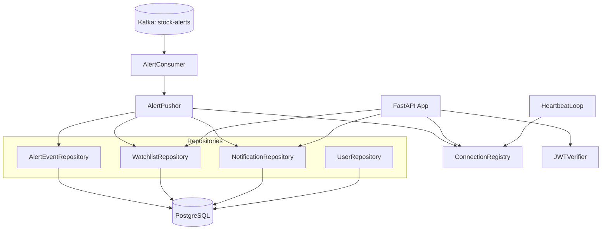
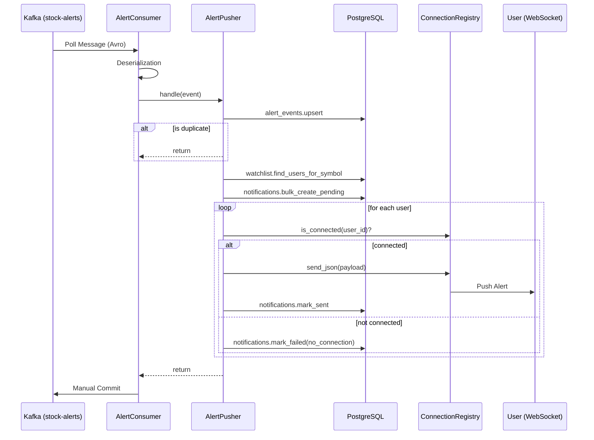
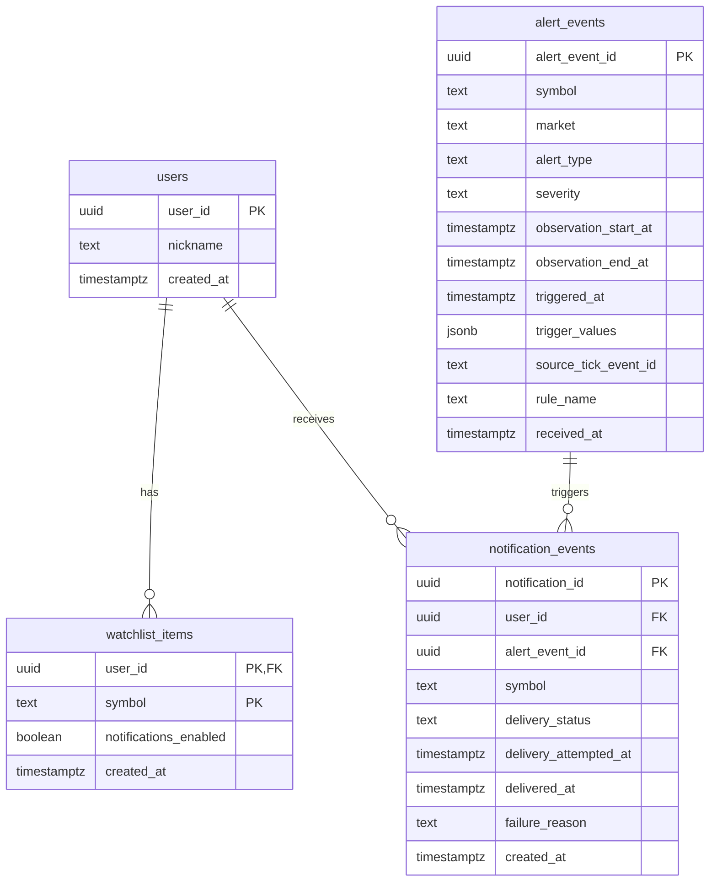

---
aliases:
- 14 Alert Serving Design
tags:
- design
- alert-service
- websocket
- kafka
created: 2026-05-22
---

# 14 Alert Serving Design

이 문서는 두드림 v1의 **Alert Serving 상세 설계**다. 상위 의사결정은 [[11-design-freeze-discussion-pack]]를 따르며, **알림 서빙 및 사용자 인터페이스 경계는 이 문서를 source of truth**로 본다.

## Freeze Sync Extract

- **Single Instance v1**: WebSocket 세션 관리를 단순화하기 위해 v1은 단일 인스턴스로 운영한다.
- **JWT HS256 Verify**: 인증은 HS256 기반 JWT 검증만 수행하며, 발급(Issuance)은 별도 스코프다.
- **Confluent Schema Registry**: `stock-alerts` 소비 시 Schema Registry를 연동하여 Avro 역직렬화를 수행한다.
- **Avro Enum + Logical Timestamp**: `market`, `alert_type`, `severity`는 Avro Enum을 사용하며, 시각 필드는 `timestamp-millis` logical type을 사용한다.
- **Enrichment-events Excluded**: `enrichment-events` 소비 및 처리는 15번 설계에서 다루며, 본 문서의 In Scope에서는 제외한다.

## 0. Scope Boundary

### In Scope

- **`stock-alerts` Consume**: Kafka `stock-alerts` 토픽 소비 및 Avro 역직렬화
- **DB Persistence**: 알림 이벤트(`alert_events`) 및 사용자 알림(`notification_events`) 저장
- **WebSocket Fanout**: 접속 중인 사용자에게 실시간 알림 푸시
- **Watchlist CRUD**: 사용자별 관심 종목 관리 REST API
- **Notification Recovery**: 미수신 알림 복구를 위한 `since` 기반 REST 조회
- **JWT Verification**: WebSocket 및 REST API 접근 제어를 위한 토큰 검증

### Out of Scope

- **Enrichment-events**: 리포트 요약 등 외부 데이터 결합 알림 (→ [[15-batch-enrichment-design]])
- **Multi-instance**: Redis Pub/Sub 등을 이용한 다중 인스턴스 확장 (Future Scaling 전용)
- **Redis / ws-gateway**: 외부 세션 저장소나 전용 게이트웨이 도입
- **JWT Issuance**: 로그인/회원가입을 통한 토큰 발급 로직
- **Admin / Metrics**: 관리자 API 및 Prometheus 메트릭 노출
- **READ Tracking**: 사용자의 알림 읽음 상태 추적

### Boundary Statement

Alert Serving의 책임은 **Flink가 생성한 `stock-alerts`를 안정적으로 소비하여 DB에 영속화하고, 관심 종목을 등록한 사용자 중 현재 WebSocket으로 연결된 이들에게 실시간으로 알림을 전달하는 것**까지다.

## 1. Why separate this file

- `alert_service`는 실시간 사용자 접점(WebSocket)과 REST API를 동시에 제공하는 **User-facing Realtime Layer**다.
- 13번(Flink Stream)은 데이터 가공에 집중하고, 15번(Batch Enrichment)은 비실시간 데이터 결합에 집중하므로, **사용자 세션 관리와 알림 전달 상태(Delivery Status)를 책임지는 서빙 레이어**를 별도 설계로 분리한다.

## 2. External constraints

- **Kafka stock-alerts contract**: 13번(Flink)이 발행하는 `stock-alerts` 토픽의 스키마를 준수해야 한다.
- **Single PostgreSQL**: 모든 영속 데이터는 단일 PostgreSQL의 `alert_service` 스키마에 저장한다.
- **Single Instance v1**: 다중 인스턴스 환경에서의 WebSocket 세션 공유(Redis 등)를 고려하지 않는다.
- **MSA SRP**: Enrichment 데이터와의 결합은 이벤트를 통한 느슨한 결합을 지향하며, 서빙 레이어는 전달(Delivery)에 집중한다.

## 3. Alert Serving scope responsibilities

- **Auth Verify**: JWT 토큰을 검증하여 사용자 식별
- **Consume**: `stock-alerts` 토픽으로부터 알림 이벤트 수신
- **Persist**: 수신된 이벤트를 `alert_events` 테이블에 멱등적으로 저장
- **Fanout**: 해당 종목을 관심 종목으로 등록한 사용자 목록 추출
- **Push**: 연결된 사용자에게 WebSocket으로 JSON 메시지 전송
- **Recovery**: 재연결 시 누락된 알림을 REST API로 제공
- **Heartbeat**: WebSocket 연결 유지를 위한 주기적 Ping 전송

## 4. Proposed components



### Component definitions

| Component | File path | Role |
| --- | --- | --- |
| `AlertConsumer` | `kafka/consumer.py` | Confluent Consumer + AvroDeserializer 기반 소비, bounded queue를 통한 백프레셔 관리, 수동 커밋 |
| `AlertPusher` | `ws/pusher.py` | 알림 이벤트 저장 → 관심 사용자 추출 → 알림 생성 → WebSocket 팬아웃 및 상태 기록 |
| `ConnectionRegistry` | `ws/registry.py` | 메모리 내 `user_id -> set[WS]` 매핑 관리, 전송 실패 시 자동 제거 |
| `HeartbeatLoop` | `api/heartbeat.py` | 25초마다 모든 연결에 `{"type":"ping"}` 전송하여 좀비 세션 방지 |
| `JWTVerifier` | `auth/jwt.py` | HS256 알고리즘 기반 JWT 검증 및 `user_id` 추출 |
| `Repositories` | `repository/*.py` | SQLAlchemy AsyncSession 기반 DB 접근 (Alert, Watchlist, Notification, User) |
| `FastAPI app` | `api/app.py` | Lifespan을 통한 Consumer/Heartbeat 시작, REST/WS 라우팅 및 CORS 설정 |
| `Container` | `container.py` | Plain factory 패턴 기반 의존성 주입 및 객체 그래프 조립 |

## 5. Core flows

### 5-1. Startup flow

1. `config` 로드 및 `Container` 초기화
2. DB `engine` 및 `session_factory` 생성
3. FastAPI `lifespan` 시작:
   - `AlertConsumer.start()` 호출 (별도 태스크로 실행)
   - `heartbeat_loop()` 시작
4. Uvicorn 서버 가동 및 요청 수신 대기

### 5-2. Alert flow



### 5-3. Connection recovery flow

1. 클라이언트 WebSocket 연결 끊김 감지
2. 클라이언트 재연결 시도: `GET /ws?token=<jwt>`
3. 서버: JWT 검증 후 연결 수락 및 `Registry` 등록
4. 클라이언트: 누락된 알림 복구를 위해 `GET /api/notifications?since=<last_received_at>` 호출
5. 서버: DB에서 해당 시점 이후의 알림 목록 반환

### 5-4. Watchlist CRUD flow

- `GET /api/watchlist`: 현재 사용자의 관심 종목 목록 조회
- `POST /api/watchlist`: 새 종목 추가 (중복 시 409 Conflict)
- `DELETE /api/watchlist/{symbol}`: 종목 제거
- `PATCH /api/watchlist/{symbol}`: 알림 활성화 여부(`notifications_enabled`) 수정

## 6. External interface draft

### 6-1. REST API

| Method | Path | Description |
| --- | --- | --- |
| `GET` | `/api/watchlist` | 관심 종목 목록 조회 |
| `POST` | `/api/watchlist` | 관심 종목 추가 (`{"symbol": "..."}`) |
| `DELETE` | `/api/watchlist/{symbol}` | 관심 종목 삭제 |
| `PATCH` | `/api/watchlist/{symbol}` | 알림 설정 수정 (`{"notifications_enabled": bool}`) |
| `GET` | `/api/notifications` | 알림 이력 조회 (`since`, `limit` 필터) |
| `GET` | `/health` | 헬스체크 (DB 연결 확인 포함) |

### 6-2. WebSocket protocol

- **Endpoint**: `GET /ws?token=<jwt>`
- **Authentication**: Query parameter `token` 필수 (HS256 JWT)
- **Protocol**: Server-push only (클라이언트 메시지는 무시)
- **Heartbeat**: 서버에서 25초마다 `{"type":"ping"}` 전송
- **Close Codes**: 인증 실패 시 `1008 Policy Violation`으로 종료

### 6-3. Server-pushed message format (JSON)

```json
{
  "type": "alert",
  "notification_id": "uuid",
  "alert_event_id": "uuid",
  "symbol": "005930",
  "market": "KRX",
  "alert_type": "PRICE_ALERT",
  "severity": "CRITICAL",
  "observation_start_at": "2026-05-22T09:00:00Z",
  "observation_end_at": "2026-05-22T09:05:00Z",
  "triggered_at": "2026-05-22T09:05:01Z",
  "trigger_values": {
    "current_price": "75000",
    "threshold": "74500"
  },
  "rule_name": "Price Above Threshold"
}
```
*모든 일시는 ISO 8601 형식이며 `Z` 접미사를 포함한다.*

## 7. `stock-alerts` consume contract

### 7-1. Kafka record structure

- **Key**: `symbol` (bytes)
- **Value**: Avro binary (Magic byte `0x00` + 4-byte `schema_id` + Payload)
- **Headers**: 별도의 필수 헤더 없음 (13번이 자유롭게 추가 가능)

### 7-2. Value schema (11 fields)

| # | Field | Avro Type | Notes |
| --- | --- | --- | --- |
| 1 | `alert_event_id` | string | UUID |
| 2 | `symbol` | string | 종목 코드 |
| 3 | `market` | enum {KRX, NXT} | 시장 구분 |
| 4 | `alert_type` | enum {PRICE_ALERT, VI_IMMINENT, MOMENTUM_SHIFT, TRADING_HALT} | 알림 유형 |
| 5 | `severity` | enum {INFO, WARNING, CRITICAL} | 심각도 |
| 6 | `observation_start_at` | long (timestamp-millis) | 관찰 시작 시각 |
| 7 | `observation_end_at` | long (timestamp-millis) | 관찰 종료 시각 |
| 8 | `triggered_at` | long (timestamp-millis) | 발생 시각 |
| 9 | `trigger_values` | map<string> | 발생 당시 지표값 (values=string) |
| 10 | `source_tick_event_id` | union [null, string] | 원천 틱 ID (nullable) |
| 11 | `rule_name` | string | 적용된 규칙 이름 |

### 7-3. Avro encoding details

- **Timestamp**: `long` 타입에 `timestamp-millis` logical type 적용
- **Enum**: `Market`, `AlertType`, `Severity`는 Avro Enum으로 정의하여 타입 안전성 확보

### 7-4. `trigger_values` expected keys per alert_type

| Alert Type | Expected Keys |
| --- | --- |
| `PRICE_ALERT` | `current_price`, `change_rate`, `threshold`, `prev_close` |
| `VI_IMMINENT` | `vi_trigger_price`, `current_price`, `distance_pct`, `direction` |
| `MOMENTUM_SHIFT` | `rsi`, `macd`, `macd_signal`, `price_change_5m` |
| `TRADING_HALT` | `halt_started_at`, `halt_ended_at` (nullable), `last_traded_price` |

### 7-5. observation_* per alert_type

| Alert Type | Window / Semantics |
| --- | --- |
| `PRICE_ALERT` | 5-min window (or specific detection window) |
| `VI_IMMINENT` | VI detection window |
| `MOMENTUM_SHIFT` | 5-min sliding window |
| `TRADING_HALT` | Halt duration window |

### 7-6. Schema Registry integration

- **Subject**: `stock-alerts-value` (TopicNameStrategy)
- **Compatibility**: `BACKWARD`
- **Wire Format**: Confluent Avro format (Magic byte `0x00` + 4-byte `schema_id`)
- **Registration**: `scripts/register_schemas.py`를 통해 CI 또는 배포 시 사전 등록

## 7-a. Implementation structure

### Package layout (`services/alert_service/`)

```
src/alert_service/
├── __main__.py        # Entrypoint
├── container.py       # DI Container (Plain factory)
├── config.py          # AlertServiceConfig (pydantic-settings)
├── api/
│   ├── app.py         # FastAPI app factory
│   ├── heartbeat.py   # WebSocket heartbeat loop
│   └── routes/        # REST & WS endpoints
├── auth/
│   └── jwt.py         # JWT Verifier
├── kafka/
│   └── consumer.py    # Kafka Consumer (Avro)
├── repository/        # DB Repositories
└── ws/
    ├── pusher.py      # Alert fanout logic
    └── registry.py    # Connection management
```

## 8. DB schema

### ER Diagram (alert_service schema)



### Table: `users`
| Column | Type | Constraints |
| --- | --- | --- |
| `user_id` | UUID | PRIMARY KEY |
| `nickname` | TEXT | NOT NULL |
| `created_at` | TIMESTAMPTZ | NOT NULL, DEFAULT now() |

### Table: `watchlist_items`
| Column | Type | Constraints |
| --- | --- | --- |
| `user_id` | UUID | PRIMARY KEY, FOREIGN KEY (users) |
| `symbol` | TEXT | PRIMARY KEY |
| `notifications_enabled` | BOOLEAN | NOT NULL, DEFAULT TRUE |
| `created_at` | TIMESTAMPTZ | NOT NULL, DEFAULT now() |
*Index: `(symbol, notifications_enabled)`*

### Table: `alert_events`
| Column | Type | Constraints |
| --- | --- | --- |
| `alert_event_id` | UUID | PRIMARY KEY |
| `symbol` | TEXT | NOT NULL |
| `market` | TEXT | NOT NULL, CHECK (KRX, NXT) |
| `alert_type` | TEXT | NOT NULL, CHECK (PRICE_ALERT, ...) |
| `severity` | TEXT | NOT NULL, CHECK (INFO, WARNING, CRITICAL) |
| `observation_start_at` | TIMESTAMPTZ | NOT NULL |
| `observation_end_at` | TIMESTAMPTZ | NOT NULL |
| `triggered_at` | TIMESTAMPTZ | NOT NULL |
| `trigger_values` | JSONB | NOT NULL |
| `source_tick_event_id` | TEXT | NULLABLE |
| `rule_name` | TEXT | NOT NULL |
| `received_at` | TIMESTAMPTZ | NOT NULL, DEFAULT now() |
*Indexes: `(symbol, triggered_at DESC)`, `(triggered_at DESC)`*

### Table: `notification_events`
| Column | Type | Constraints |
| --- | --- | --- |
| `notification_id` | UUID | PRIMARY KEY |
| `user_id` | UUID | NOT NULL, FOREIGN KEY (users) |
| `alert_event_id` | UUID | NOT NULL, FOREIGN KEY (alert_events) |
| `symbol` | TEXT | NOT NULL |
| `delivery_status` | TEXT | NOT NULL, CHECK (PENDING, SENT, FAILED) |
| `delivery_attempted_at` | TIMESTAMPTZ | NULLABLE |
| `delivered_at` | TIMESTAMPTZ | NULLABLE |
| `failure_reason` | TEXT | NULLABLE, CHECK (no_connection, send_error) |
| `created_at` | TIMESTAMPTZ | NOT NULL, DEFAULT now() |
*Unique: `(user_id, alert_event_id)`*
*Indexes: `(user_id, created_at DESC)`, `(alert_event_id)`*

## 9. 신뢰성 / 장애 복구

- **Consumer supervision**: `AlertConsumer`가 `is_alive()`, `wait_dead()`, `fatal_error` API를 통해 백그라운드 컨슈머 태스크의 사망을 감지한다. (`kafka/consumer.py`)
- **Fail-fast dispatch**: 메시지 핸들러(`on_message`) 실패 시 offset을 커밋하지 않고 예외를 re-raise하여, 메시지 유실을 방지하고 재시작 시 해당 지점부터 재처리를 보장한다. (`kafka/consumer.py`)
- **Liveness 반영**: 컨슈머 태스크가 죽으면 `__main__.py`의 supervisor가 이를 감지해 uvicorn 서버를 종료(`should_exit=True`)하고 비정상(non-zero) exit 코드로 종료한다. 이는 k8s/docker의 재시작 정책을 트리거한다. 또한 `/health` 엔드포인트가 컨슈머 liveness 상태를 반영한다. (`__main__.py`, `api/routes/health.py`)
- **Resumable fanout**: `bulk_create_pending`이 이미 존재하는 PENDING 상태의 행만 반환(SENT/FAILED 제외)함으로써, 중복 알림 수신 시 미완료된 fanout 작업만 안전하게 재개한다. (`repository/notifications.py`, `ws/pusher.py`)
- **Poison-pill 주의 + 복구 절차**: nil UUID sentinel(`00000000-0000-0000-0000-000000000000`) 등 영구 실패 메시지는 offset 미커밋으로 인해 무한 재시작 루프를 유발할 수 있다. 복구 시에는 컨슈머를 일시 중지(scale=0)하고 `kafka-consumer-groups --reset-offsets --to-latest` 명령으로 오프셋을 강제 이동시킨 후 재기동한다. (운영 절차)

(출처: Plan 21)

## 10. Future Scaling

| Option | Pros | Cons |
| --- | --- | --- |
| **Option A: Redis Pub/Sub** | 구현이 비교적 단순하며 별도 서비스 구축 불필요 | Redis 운영 부담, 추가 네트워크 홉, 메시지 순서 보장 어려움 |
| **Option B: Dedicated ws-gateway** | 서빙 로직과 세션 관리의 완전 분리, 독립적 확장 가능 | 별도 서비스 구축 및 운영 복잡도 증가 |
| **Option C: Sticky Session** | 인프라 레벨(L7 LB)에서 해결 가능 | 인스턴스 장애 시 해당 세션 모두 끊김, 부하 불균형 가능성 |

*v1은 단일 인스턴스로 운영하며, 향후 트래픽 증가 시 위 옵션 중 하나를 선택하여 확장한다.*

## 11. Resolved design decisions

| # | 질문 | 결정 |
| --- | --- | --- |
| Q1 | 인스턴스 구성 | v1은 단일 인스턴스로 운영하여 세션 관리 단순화 |
| Q2 | 인증 방식 | HS256 JWT 검증만 수행 (발급은 외부 스코프) |
| Q3 | 팬아웃 방식 | DB Watchlist 조인 후 메모리 Registry 기반 팬아웃 |
| Q4 | 전달 상태 관리 | PENDING/SENT/FAILED 3단계 상태 및 실패 사유 기록 |
| Q5 | 알림 복구 | 클라이언트가 REST API(`since` 파라미터)를 통해 직접 복구 |
| Q6 | 관심 종목 API | `alert_service` 내에 Watchlist CRUD API 포함 |
| Q7 | 다중 연결 허용 | 동일 유저의 다중 디바이스/브라우저 접속 허용 (`set[WS]`) |
| Q8 | 스키마 관리 | Schema Registry 연동 및 Avro Enum/Logical Type 사용 |
| Q9 | 독약 메시지 처리 | 역직렬화 실패 시 로그 남기고 해당 오프셋 스킵(Commit) |
| Q10 | 모니터링 | v1에서는 Prometheus 제외, 로그 기반 모니터링 |
| Q11 | 관리자 기능 | v1에서는 `/admin` 경로 제외 |
| Q12 | 컬럼 명명 규칙 | `observation_start_at`, `observation_end_at` 등 명확한 시점 명시 |
| Q13 | Watchlist PK | `(user_id, symbol)` 복합 키 사용 |
| Q14 | 알림 중복 방지 | `(user_id, alert_event_id)` Unique 제약으로 멱등성 보장 |
| Q15 | 하트비트 주기 | 25초 주기로 JSON Ping 전송 |

## 12. Remaining open questions

- **Sticky Session Threshold**: 어느 정도의 동시 접속자 수에서 다중 인스턴스 전환이 필요한가?
- **JWT Issuer Service**: 실제 운영 환경에서 토큰을 발급할 인증 서비스의 구체적 계획
- **Agent Read API**: 에이전트가 알림 맥락을 읽기 위한 전용 API의 필요성 및 형태

## 13. v1 implementation scope

- **Current**: `stock-alerts` 소비, DB 저장, WebSocket 푸시, Watchlist/Notification REST API, JWT 검증
- **Next Scoped**: `enrichment-events` 연동, 알림 읽음 처리, 다중 인스턴스 확장
- **Out of Scope**: JWT 발급, 관리자 UI, 상세 메트릭 대시보드

## 14. Immediate next split after Alert Serving

Alert Serving 다음으로는 아래 순서로 분리하는 것이 자연스럽다.

1. `15-batch-enrichment-design.md` — Airflow / outbox / Debezium / enrichment-events scope

## Related Notes

- [[11-design-freeze-discussion-pack]]
- [[12-kis-realtime-ingress-design]]
- [[event-driven-stock-pipeline]]
- [[04-sequence-alert-detection]]
