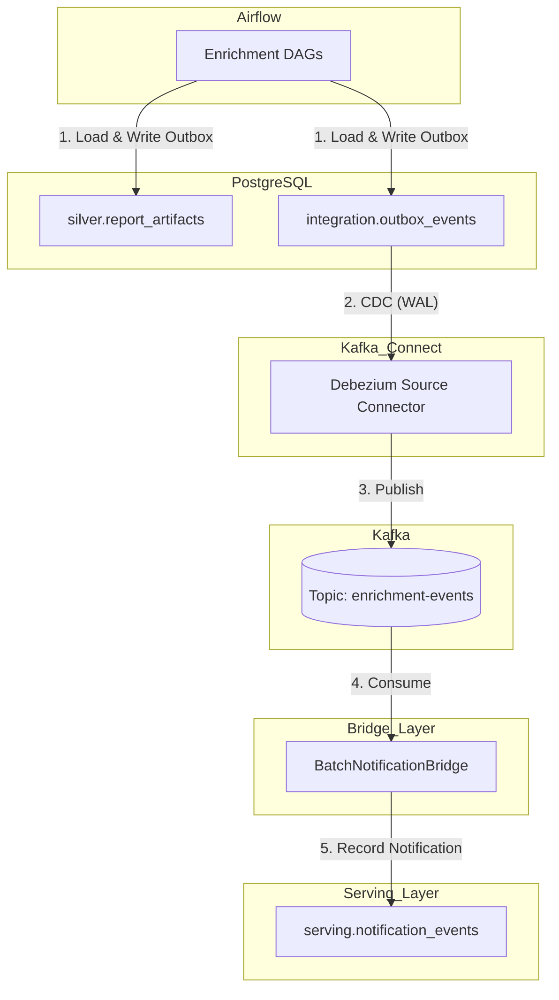
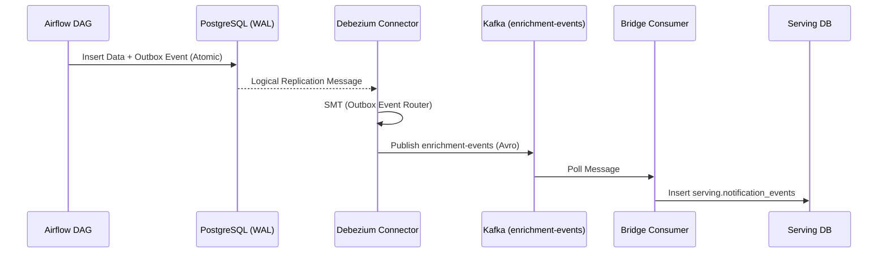
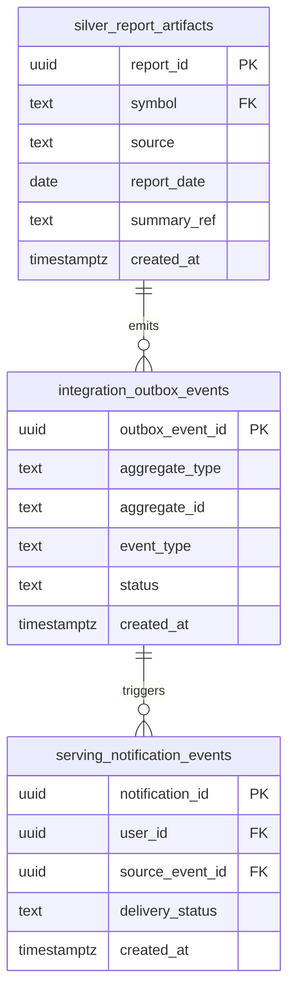

---
aliases:
- 15 Batch Enrichment Design
tags:
- design
- batch-enrichment
- airflow
- debezium
- kafka
created: 2026-06-02
---

# 15 Batch Enrichment Design

이 문서는 두드림 v1의 **Batch Enrichment 상세 설계**다. 상위 의사결정은 [[11-design-freeze-discussion-pack]]를 따르며, **배치 enrichment 및 CDC(Outbox→Debezium→enrichment-events) 경계는 이 문서를 source of truth**로 본다.

## Freeze Sync Extract

- **FR-07**: 비실시간 외부 소스는 Airflow에서 PostgreSQL로 직접 적재하고, 사용자 알림이 필요한 경우 outbox에 기록해야 한다.
- **FR-08**: Debezium은 outbox를 CDC하여 `enrichment-events`를 Kafka에 발행해야 한다.
- **Outbox Pattern**: 비실시간 데이터 적재와 이벤트 발행 간의 원자성(Atomicity)을 보장하기 위해 `integration.outbox_events` 테이블을 활용한다.
- **Topic Ownership**: `enrichment-events` 토픽의 Producer는 Debezium(Kafka Connect)이며, Primary Consumer는 별도의 bridge consumer다.
- **WAL Level**: CDC 동작을 위해 PostgreSQL의 `wal_level`은 `logical`로 설정되어야 한다. (→ [[event-driven-stock-pipeline]])

## 0. Scope Boundary

### In Scope

- **Airflow Orchestration**: 비실시간 외부 소스 데이터를 PostgreSQL에 적재하는 DAG 설계
- **Data Loading**: `silver.report_artifacts` 테이블에 enrichment 결과물 적재
- **Outbox Logging**: 사용자 알림이 필요한 시점에 `integration.outbox_events` 기록
- **Debezium Source Connector**: PostgreSQL WAL을 읽어 `enrichment-events` 토픽으로 발행
- **Kafka Topic Contract**: `enrichment-events` 토픽의 Avro 스키마 정의
- **Bridge Consumer**: `enrichment-events`를 소비하여 `serving.notification_events`에 알림 상태 기록

### Out of Scope

- **`stock-alerts` Processing**: Flink가 생성하는 실시간 가격 알림 처리 (→ [[14-alert-serving-design]])
- **Stream Detection**: Flink 기반의 실시간 스트림 가공 로직 (→ [[16-stream-detection-design]])
- **WebSocket Push**: 사용자 대상 실시간 푸시 전송 로직 (→ [[14-alert-serving-design]])
- **Scraping Implementation**: 외부 소스의 스크래핑 구현 세부(엔드포인트, 세션, 파싱, 인증 토큰 등)는 본 문서 범위가 아니며, 수집기는 데이터를 PostgreSQL에 적재하는 black-box로 취급한다.

### Boundary Statement

Batch Enrichment의 책임은 **비실시간 외부 데이터를 수집하여 DB에 적재하고, 알림이 필요한 이벤트를 Outbox 패턴과 Debezium CDC를 통해 Kafka로 발행하여 실시간 서빙 레이어와 합류시키는 것**까지다.

## 1. Why separate this file

- **Batch vs Realtime**: KIS 기반의 실시간 경로와 Airflow 기반의 배치 경로는 오케스트레이션 도구와 데이터 유입 주기가 완전히 다르므로 설계를 분리한다.
- **MSA SRP**: 데이터 수집/가공(Batch Enrichment)과 사용자 서빙(Alert Serving)의 책임을 분리하여 시스템 복잡도를 낮춘다.
- **CDC Complexity**: Debezium 설정, Outbox 스키마, Avro 계약 등 CDC 특유의 기술적 세부 사항을 집중적으로 다루기 위해 별도 문서로 관리한다.

## 2. External constraints

- **wal_level=logical**: PostgreSQL 서버 설정에서 논리적 복제(Logical Replication)가 활성화되어 있어야 한다.
- **Single PostgreSQL**: 모든 배치 데이터와 Outbox 로그는 단일 PostgreSQL 인스턴스 내의 지정된 스키마에 저장한다.
- **Kafka Connect 운영**: Debezium 커넥터를 실행할 Kafka Connect 클러스터와 Confluent Schema Registry 연동이 필요하다.
- **MSA SRP**: 배치 레이어는 서빙 레이어의 내부 로직을 알지 못하며, 오직 이벤트를 통해서만 상태 변화를 전달한다.

## 3. Batch Enrichment scope responsibilities

- **Orchestrate**: Airflow를 통해 주기적인 데이터 수집 및 가공 워크플로우 관리
- **Load**: 수집된 데이터를 `silver.report_artifacts` 등 도메인 테이블에 Upsert
- **Outbox-write**: 데이터 적재와 동일한 트랜잭션 내에서 `integration.outbox_events`에 이벤트 기록
- **CDC-publish**: Debezium을 통해 Outbox 이벤트를 `enrichment-events` 토픽으로 발행
- **Bridge-consume**: 발행된 이벤트를 소비하여 서빙 레이어의 알림 테이블(`serving.notification_events`)에 반영

## 4. Proposed components



### Component definitions

| Component | Role |
| --- | --- |
| `Enrichment DAGs` | 비실시간 외부 소스로부터 데이터를 수집하여 `silver` 스키마에 적재하고 알림 대상을 Outbox에 기록 |
| `integration.outbox_events` | CDC 대상이 되는 이벤트 로그 테이블. 비즈니스 데이터와 원자적 트랜잭션 보장 |
| `Debezium Source` | PostgreSQL의 Logical Replication Slot을 점유하여 Outbox 테이블의 변경분을 Kafka로 전송 |
| `enrichment-events` | 배치 enrichment 완료 및 알림 트리거를 담은 Avro 기반 Kafka 토픽 |
| `BatchNotificationBridge` | `enrichment-events`를 소비하여 `alert_service`가 인지할 수 있는 형태로 알림 상태를 DB에 기록하는 전용 컨슈머 |

## 5. Core flows

### 5-1. Enrichment load flow

1. Airflow DAG가 스케줄에 따라 기동된다.
2. 외부 소스 수집기(Black-box)를 호출하여 최신 리포트 또는 지표 데이터를 가져온다.
3. `silver.report_artifacts` 테이블에 데이터를 Upsert 한다.
4. 사용자 알림이 필요한 항목(예: 신규 리포트 도착)에 대해 `integration.outbox_events`에 행을 추가한다.
5. 위 3, 4번 과정은 단일 DB 트랜잭션으로 묶여 실행된다.

### 5-2. Outbox → CDC → publish flow



### 5-3. Report-arrival notification flow

- 배치 파이프라인에서 생성된 `enrichment-events`는 Bridge Consumer를 통해 `serving.notification_events`에 `PENDING` 상태로 기록된다.
- 이후의 실시간 푸시 과정은 [[14-alert-serving-design]]의 WebSocket Fanout 로직과 합류하여 사용자에게 전달된다.
- 이 구조를 통해 배치 데이터 알림도 실시간 가격 알림과 동일한 서빙 경로를 공유하게 된다.

## 6. External interface draft

### 6-1. enrichment-events topic

- **Key**: `report_id` (string, UUID)
- **Value**: Avro binary
- **Subject**: `enrichment-events-value`

### 6-2. Debezium Source connector config sketch

```yaml
name: postgres-outbox-source
config:
  connector.class: io.debezium.connector.postgresql.PostgresConnector
  database.hostname: postgres
  database.port: 5432
  database.user: debezium
  database.password: ${file:/secrets/postgres:password}
  database.dbname: invest_view
  database.server.name: dbserver1
  table.include.list: integration.outbox_events
  plugin.name: pgoutput
  slot.name: debezium_outbox_slot
  transforms: outbox
  transforms.outbox.type: io.debezium.transforms.outbox.EventRouter
  transforms.outbox.table.fields.additional.placement: "type:header:event_type"
```

## 7. `enrichment-events` contract details

### Avro field table (Value)

| # | Field | Avro Type | Notes |
| --- | --- | --- | --- |
| 1 | `report_id` | string | UUID |
| 2 | `symbol` | string | 관련 종목 코드 |
| 3 | `report_type` | string | 리포트 유형 (예: COMPANY, SECTOR) |
| 4 | `available_at` | long (timestamp-millis) | 데이터 가용 시점 |
| 5 | `summary_ref` | string | 요약문 참조 (S3 URL 또는 DB Key) |
| 6 | `delivery_target` | string | 알림 대상 구분 (예: WATCHLIST_USERS) |

- **Encoding**: Confluent Avro format
- **Compatibility**: BACKWARD

## 8. DB schema

### ER Diagram



### Table: `silver.report_artifacts`
| Column | Type | Constraints |
| --- | --- | --- |
| `report_id` | UUID | PRIMARY KEY |
| `symbol` | TEXT | NOT NULL |
| `source` | TEXT | NOT NULL |
| `report_date` | DATE | NOT NULL |
| `summary_ref` | TEXT | NOT NULL |
| `created_at` | TIMESTAMPTZ | NOT NULL, DEFAULT now() |

### Table: `integration.outbox_events`
| Column | Type | Constraints |
| --- | --- | --- |
| `outbox_event_id` | UUID | PRIMARY KEY |
| `aggregate_type` | TEXT | NOT NULL |
| `aggregate_id` | TEXT | NOT NULL |
| `event_type` | TEXT | NOT NULL |
| `status` | TEXT | NOT NULL |
| `created_at` | TIMESTAMPTZ | NOT NULL, DEFAULT now() |

## 9. 신뢰성 / 장애 복구

- **Transactional Guarantee**: Outbox 패턴을 통해 비즈니스 데이터 적재와 이벤트 발행 로그 기록을 단일 트랜잭션으로 묶어 "적재되었으나 알림이 안 가는" 상황을 방지한다.
- **At-least-once Delivery**: Debezium은 Kafka에 최소 한 번 전송을 보장하며, Bridge Consumer는 DB Upsert를 통해 중복 메시지를 멱등하게 처리한다.
- **Debezium Recovery**: Connector 장애 시 마지막으로 성공한 LSN(Log Sequence Number)부터 재시작하여 데이터 유실을 방지한다.
- **DAG Retry**: Airflow의 재시도 메커니즘을 통해 일시적인 외부 소스 수집 실패를 복구한다.

## 10. Future Scaling

| Option | Pros | Cons |
| --- | --- | --- |
| **Debezium 범위 확장** | 모든 Silver 테이블 변경을 CDC하여 실시간 동기화 가능 | WAL 부하 증가, 불필요한 이벤트 과다 발행 위험 |
| **Multiple Source DAGs** | 소스별 독립적 스케줄링 및 장애 격리 | 관리 포인트 증가 |
| **SMT Routing 고도화** | 단일 Outbox 테이블에서 여러 토픽으로 정교한 라우팅 가능 | 커넥터 설정 복잡도 증가 |

## 11. Resolved design decisions

| # | 질문 | 결정 |
| --- | --- | --- |
| D1 | Debezium CDC 범위 | v1은 'report ready'(알림 트리거)를 위한 Outbox 테이블만 CDC 대상으로 둔다. Silver 전체 CDC는 차기로 미룬다. |
| D2 | 결정 사유 | v1의 핵심 가치는 알림 파이프라인이며, 전체 데이터 동기화는 복잡도 대비 효용이 낮음. |
| D3 | Bridge Consumer 필요성 | `alert_service`가 직접 Kafka를 읽는 대신 전용 Bridge를 두어 서빙 레이어의 SRP를 유지한다. |
| D4 | Outbox 스키마 표준 | Debezium Outbox Event Router SMT가 요구하는 표준 필드 구성을 따른다. |
| D5 | 데이터 보존 주기 | `outbox_events`는 CDC 완료 후 일정 기간(예: 7일) 뒤 Airflow Cleanup DAG로 삭제한다. |

## 12. Remaining open questions

- **Large Payload Handling**: 리포트 요약문이 매우 길 경우 Kafka 메시지 크기 제한에 걸릴 수 있으므로, S3 링크 전달 방식을 기본으로 검토한다.
- **Backfill Strategy**: 과거 리포트 대량 적재 시 알림 폭주를 방지하기 위한 Outbox 기록 제어 방안.

## 13. v1 implementation scope

- **Current**: Airflow 리포트 적재 DAG, Outbox 기록 로직, Debezium 커넥터 설정, Bridge Consumer 구현.
- **Next Scoped**: Silver 전체 테이블 CDC 전환, 다중 소스 확장.
- **Out of Scope**: 외부 소스 스크래핑 엔진 고도화, 실시간 리포트 수집(KIS 등).

## 14. Immediate next split after Batch Enrichment

Batch Enrichment 다음으로는 아래 순서로 분리하는 것이 자연스럽다.

1. `16-stream-detection-design.md` — Flink window / alert / pattern scope

## Related Notes

- [[11-design-freeze-discussion-pack]]
- [[14-alert-serving-design]]
- [[16-stream-detection-design]]
- [[event-driven-stock-pipeline]]
