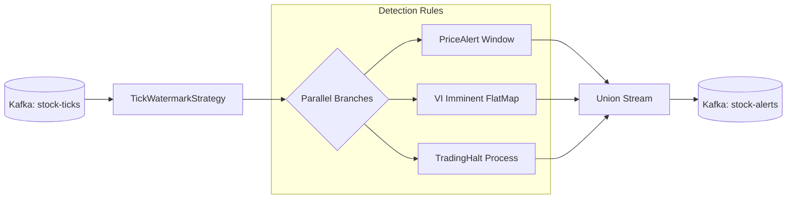

---
aliases:
- 16 Stream Detection Design
tags:
- design
- stream-detection
- flink
created: 2026-06-01
---

# 16 Stream Detection Design

이 문서는 두드림 v1의 **Flink 실시간 감지 레이어 상세 설계**다. 상위 의사결정은 [[11-design-freeze-discussion-pack]]를 따르며, stream-detection 경계는 이 문서를 source of truth로 본다.

## Freeze Sync Extract

- **Java DataStream API**: PyFlink의 의존성 관리 복잡성(fat JAR 부재 등)을 해결하기 위해 Java로 피벗하여 구현한다.
- **UUID5 Idempotency**: SHA-1 기반 UUID v5를 사용하여 체크포인트 복구 시에도 동일한 `alert_event_id`를 생성, DB 레벨에서 자동 멱등성을 보장한다.
- **FLINK-11030 Workaround**: Avro GenericRecord의 Decimal 역직렬화 버그를 우회하기 위해 SpecificRecord 코드 생성 방식을 채택한다.
- **Strict Schema Management**: `auto.register.schemas`를 금지하고, `AvroSchemaGuard`를 통해 기동 시 Schema Registry 등록 여부를 강제 검증한다.
- **Event Time via received_at**: `trade_time`의 날짜 정보 부재 문제를 해결하기 위해 수집 레이어에서 찍은 `received_at`(ISO8601 UTC)을 워터마크 기준으로 사용한다.

## 0. Scope Boundary

### In Scope

- **Real-time Detection**: 가격 변동성(Price Alert), VI 근접(VI Imminent), 거래 정지 상태 전이(Trading Halt) 감지
- **Stateful Processing**: 5분 슬라이딩 윈도우 및 상태 기반 전이 감지
- **Idempotent ID Generation**: Python과 호환되는 UUID5 기반 멱등 키 생성
- **Schema Validation**: 기동 시 SR 연동 및 스키마 정합성 체크

### Out of Scope

- **Stock Patterns**: 골든/데드크로스, RSI, MACD 등 기술적 지표 패턴 발행 (→ Future Work)
- **Savepoint Management**: 자동화된 세이브포인트 관리 및 PVC 기반 체크포인트 (v1은 emptyDir/stateless)
- **Dynamic Rule Injection**: 런타임 규칙 변경 (현재는 환경 변수 기반 정적 설정)
- **Parallelism Scaling**: v1은 병렬도 1로 고정하여 운영 복잡도 최소화

### Boundary Statement

Stream Detection의 책임은 **Kafka `stock-ticks`를 소비하여 정의된 3종의 비즈니스 룰에 따라 실시간 이벤트를 감지하고, 이를 멱등적인 UUID와 함께 `stock-alerts` 토픽으로 발행하는 것**까지다.

## 1. Pipeline Architecture

### Job Structure

`com.invest_view.stream_detection.StreamDetectionJob` 클래스가 엔트리포인트이며, 다음과 같은 파이프라인을 구성한다.

### Environment Configuration

- **State Backend**: `HashMapStateBackend`
- **Checkpointing**: 60s 주기, `EXACTLY_ONCE` 모드
- **Fault Tolerance**: `minPauseBetweenCheckpoints(30s)`, `checkpointTimeout(600s)`, `maxConcurrentCheckpoints(1)`
- **Cleanup**: `RETAIN_ON_CANCELLATION` (수동 삭제 전까지 체크포인트 유지)
- **Parallelism**: 기본 1 (MVP 범위)

## 2. Detection Rules

| Rule Name | Alert Type | Logic | Trigger Values | Dedup Key | Severity |
| :--- | :--- | :--- | :--- | :--- | :--- |
| `price_alert_5min_3pct` | `PRICE_ALERT` | 300s Window / 60s Slide. `(max-min)/min >= threshold(3%)` | `min_price`, `max_price`, `change_rate`, `threshold` | `observationStartMs` | `WARNING` |
| `vi_imminent_1pct` | `VI_IMMINENT` | Per-tick FlatMap. `\|price - vi_trigger\| / vi_trigger <= threshold(1%)` | `price`, `vi_trigger_price`, `distance_ratio`, `threshold` | `received_at` (ISO8601) | `WARNING` |
| `trading_halt_transition` | `TRADING_HALT` | KeyedProcessFunction. `prev=="N" AND current=="Y"` 전이만 발동 | `prev_state`, `new_state`, `transition_time` | `transitionTimeMs` | `CRITICAL` |

### Common Eligibility Filter
- `trading_halted == "N"` (Trading Halt 룰 제외)
- `price > 0`
- `market` ∈ {`KRX`, `NXT`}

## 3. Serialization & Schema

### FLINK-11030 Workaround
Avro `GenericRecord` 사용 시 `decimal` logicalType이 `ByteBuffer`로 역직렬화되어 `AvroSerializer.copy()`에서 `ClassCastException`이 발생하는 버그를 해결하기 위해 다음 전략을 사용한다.
- **SpecificRecord**: `StockTick`, `StockAlert` 클래스를 Avro 스키마로부터 자동 생성
- **Decimal Conversion**: 생성된 클래스의 `MODEL$`에 `DecimalConversion`을 등록하고 `enableDecimalLogicalType=true` 설정

### Kafka Connectors
- **Source**: `stock-ticks` 토픽, `stream-detection-java` 그룹 ID, `latest` 오프셋부터 시작. `ConfluentRegistryAvroDeserializationSchema` 사용.
- **Sink**: `stock-alerts` 토픽, `AT_LEAST_ONCE` 보장. `auto.register.schemas=false` (사전 등록 필수).

## 4. Idempotent Deduplication

`AlertBuilders.java`에서 UUID v5를 생성하여 다운스트림(`alert_service`)에서의 멱등 처리를 지원한다.

- **Algorithm**: SHA-1 기반 Name-based UUID (v5)
- **Namespace**: `6ba7b810-9dad-11d1-80b4-00c04fd430c8` (DNS Namespace)
- **Format**: `uuid5(NS, "{symbol}|{alert_type}|{key}")`
- **Cross-language Identity**: Python의 `uuid.uuid5()`와 바이트 단위로 동일하게 설계되어, 언어 간 전환 시에도 동일한 ID 생성을 보장한다.

## 5. Watermark Strategy

`TickWatermarkStrategy.java`는 이벤트 타임 처리를 위해 다음과 같이 동작한다.

- **Timestamp Extraction**: `StockTick.received_at` (ISO8601 UTC) 필드를 파싱하여 Epoch Milli로 변환.
- **Out-of-orderness**: 10초 허용 (`forBoundedOutOfOrderness(Duration.ofSeconds(10))`).
- **Idleness**: 1분 설정 (`withIdleness(Duration.ofMinutes(1))`). 병렬도 1 환경에서 특정 종목의 데이터 공백이 전체 워터마크 전진을 방해하는 것을 방지한다.

## 6. Deployment & Operations

### Infrastructure
- **Flink Version**: 1.18.1
- **Flink Operator**: 1.14.0
- **Image**: `stream-detection-java:rules2`
- **Upgrade Mode**: `stateless` (v1 MVP 범위에서 세이브포인트 자동화 제외)

### Resource Allocation
- **JobManager/TaskManager**: 각 1024m Memory, 1 CPU
- **Parallelism**: 1 (TaskSlots 1)

## Resolved design decisions

| # | 질문 | 결정 |
| :--- | :--- | :--- |
| D1 | 구현 언어 선택 | PyFlink의 의존성 지옥을 피하기 위해 Java DataStream API 채택 |
| D2 | 이벤트 타임 기준 | `trade_time`은 날짜가 없어 부적합하므로 `received_at` 사용 |
| D3 | 스키마 등록 방식 | `auto.register.schemas`를 금지하고 `make schemas`로 사전 등록 강제 |
| D4 | 멱등성 보장 | UUID5 기반 `alert_event_id` 생성으로 DB 레벨 멱등성 확보 |
| D5 | 체크포인트 저장소 | MVP 단순화를 위해 PVC 없이 `emptyDir` 사용 및 `stateless` 업그레이드 |
| D6 | 병렬도 설정 | 운영 복잡도 최소화를 위해 병렬도 1로 고정 |
| D7 | 스키마 검증 | `AvroSchemaGuard`를 통해 기동 시 SR 등록 여부 즉시 검증 |

## Remaining open questions

- **State Migration**: 향후 `stateless` 모드에서 `savepoint` 기반의 유상태 업그레이드로 전환 시점
- **Scaling Strategy**: 병렬도 확장 시 KeyGroup 할당 및 워터마크 정체 해소 방안
- **Pattern Detection**: `stock-patterns` (RSI, MACD 등) 구현 일정 및 별도 Job 분리 여부

## v1 implementation scope

- **Current**: 3종 핵심 룰(Price, VI, Halt) 감지, UUID5 멱등 키, Java 기반 안정적 파이프라인
- **Next Scoped**: `stock-patterns` 추가, PVC 기반 유상태 체크포인트, 병렬도 확장
- **Out of Scope**: 런타임 동적 규칙 변경, 미국 시장 데이터 처리

## Related Notes

- [[11-design-freeze-discussion-pack]]
- [[12-kis-realtime-ingress-design]]
- [[14-alert-serving-design]]
- [[event-driven-stock-pipeline]]
