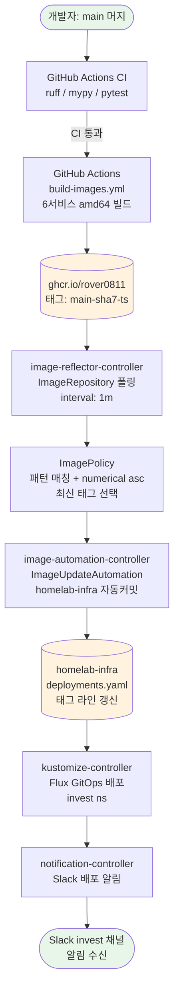

# CD 자동화 6하원칙 (5W1H)

> invest_view main 머지 한 번으로 빌드부터 배포, Slack 알림까지 사람 개입 없이 완주하는 파이프라인을 6하원칙으로 정리한다.

---

## 흐름 다이어그램



---

## Who (누가)

| 역할 | 담당 |
|---|---|
| 파이프라인 트리거 | 개발자 (main 브랜치 머지) |
| 이미지 빌드 | GitHub Actions runner |
| 태그 감지 | Flux `image-reflector-controller` |
| 매니페스트 자동 커밋 | Flux `image-automation-controller` |
| 클러스터 배포 | Flux `kustomize-controller` |
| 알림 발송 | Flux `notification-controller` |
| 알림 수신 | Slack `invest` 채널 |

개발자가 하는 일은 PR을 main에 머지하는 것뿐이다. 그 이후는 전부 자동이다.

---

## What (무엇을)

6개 서비스 이미지를 빌드하고, 태그를 자동으로 갱신하고, 클러스터에 배포하고, 결과를 Slack으로 알린다.

**빌드 대상 서비스:**

| 서비스 | 이미지 | Dockerfile |
|---|---|---|
| kis_ingestion | `ghcr.io/rover0811/kis_ingestion` | `services/kis_ingestion/Dockerfile` |
| tick_persistence | `ghcr.io/rover0811/tick_persistence` | `services/tick_persistence/Dockerfile` |
| alert_service | `ghcr.io/rover0811/alert_service` | `services/alert_service/Dockerfile` |
| event_pattern_persistence | `ghcr.io/rover0811/event_pattern_persistence` | `services/event_pattern_persistence/Dockerfile` |
| frontend | `ghcr.io/rover0811/frontend` | `frontend/Dockerfile` |
| stream_detection (Flink) | `ghcr.io/rover0811/stream_detection` | `services/stream_detection_java/Dockerfile` |

**자동화 범위:**
- amd64 이미지 빌드 및 ghcr push (맥북 수동 buildx 제거)
- homelab-infra `deployments.yaml` 태그 라인 자동 갱신 커밋 (수동 sed 제거)
- k3s homelab 클러스터 invest 네임스페이스 자동 배포 (수동 reconcile 제거)
- Slack 빌드 알림 + 배포 알림

---

## When (언제)

**빌드 트리거:**
- main 브랜치 push 후 CI(`ruff` / `mypy` / `pytest`) 통과 즉시
- `workflow_run` 이벤트로 CI 성공을 게이트로 사용 (실패 빌드 방지)

**태그 감지:**
- `image-reflector-controller`가 각 `ImageRepository`를 `interval: 1m`으로 폴링
- ghcr에 새 태그가 올라오면 다음 폴링 주기에 감지

**배포:**
- `GitRepository` interval 1m으로 homelab-infra 변경 감지
- `dependsOn` 체인 수렴 후 `invest-services` Kustomization 적용
  - 체인: `infrastructure` → `invest` → `invest-strimzi-operator` → `invest-kafka` → `invest-schema-registry` → `invest-services`
  - 체인 수렴에 시간이 걸리는 건 정상이다. 급할 때만 수동 reconcile 트리거.

---

## Where (어디서)

| 단계 | 위치 |
|---|---|
| 이미지 빌드 | GitHub Actions runner (linux/amd64) |
| 이미지 레지스트리 | `ghcr.io/rover0811` |
| 매니페스트 저장소 | `github.com/rover0811/homelab-infra` (로컬: `~/AnyProjects/homelab-infra`) |
| Image Automation CR | `homelab-infra/infrastructure/invest/image-automation/` |
| 배포 대상 클러스터 | k3s homelab (`ssh hyunsoo-cluster1`, Tailscale `100.89.9.31`) |
| 배포 네임스페이스 | `invest` |
| Flux 컨트롤러 | `flux-system` 네임스페이스 |

---

## Why (왜)

기존 배포 절차는 사람이 직접 세 단계를 수행해야 했다:

1. 맥북에서 buildx amd64 빌드 → ghcr push
2. homelab-infra `deployments.yaml` 태그를 `sed`로 수동 갱신 → 커밋 → push
3. Flux `dependsOn` 체인 전체에 reconcile 수동 annotate (10분 주기가 답답해서)

이 과정에서 발생하는 문제들:
- **휴먼 에러**: 태그 오타, 잘못된 서비스 이미지 갱신, init 컨테이너 태그 누락
- **audit trail 부재**: 누가 언제 어떤 태그로 배포했는지 git 이력에 남지 않음
- **반복 비용**: 서비스 6개를 매번 수동으로 처리

자동화 후:
- 개발자는 PR 머지만 한다
- 모든 태그 갱신이 Flux 자동커밋으로 git 이력에 남는다
- 사람 실수가 끼어들 여지가 없다

---

## How (어떻게)

### 태그 전략: `main-<sha7>-<unix_ts>`

커밋해시 단독 태그(`d592c2b`)는 Flux에서 쓸 수 없다. Flux의 `ImagePolicy`는 레지스트리 태그 문자열만 보고 최신을 판단한다. git 히스토리를 모르기 때문에 커밋해시만으로는 어느 게 더 최신인지 알 수 없다.

해법은 태그 안에 정렬 가능한 키를 넣는 것이다. Flux 공식 권장 패턴:

```
main-a1b2c3d-1718600000
     ↑sha7   ↑unix timestamp (정렬키)
```

### ImagePolicy 설정

```yaml
spec:
  filterTags:
    pattern: '^main-[a-fA-F0-9]+-(?P<ts>[0-9]+)$'
    extract: '$ts'
  policy:
    numerical:
      order: asc
```

패턴에서 타임스탬프(`ts`)를 추출하고, 숫자 오름차순으로 정렬해 가장 큰 값(가장 최근 빌드)을 선택한다.

### ImageUpdateAutomation (Setters 전략)

`deployments.yaml` 이미지 라인 끝에 marker 주석을 달아두면, `image-automation-controller`가 `ImagePolicy`의 `latestImage`로 해당 라인을 자동 갱신하고 homelab-infra에 커밋한다.

```yaml
# deployments.yaml 예시
image: ghcr.io/rover0811/tick_persistence:e831660  # {"$imagepolicy": "flux-system:tick-persistence"}
```

init 컨테이너도 동일 이미지를 쓰는 서비스(`tick_persistence`, `alert_service`, `event_pattern_persistence`)는 init 라인과 main 라인 **둘 다** marker를 달아야 한다. 하나만 달면 마이그레이션 컨테이너가 옛 이미지로 남아 스키마 불일치가 생긴다.

### 전체 흐름 요약

```
main 머지
  → CI 통과 (ruff/mypy/pytest)
  → build-images.yml 실행
  → ghcr에 main-sha7-ts 태그 6개 push
  → image-reflector-controller가 1분 이내 감지
  → ImagePolicy가 numerical asc로 최신 태그 선택
  → image-automation-controller가 deployments.yaml 태그 라인 갱신 커밋
  → kustomize-controller가 homelab-infra 변경 감지 후 invest-services 배포
  → notification-controller가 Slack invest 채널에 알림 발송
```

### Slack 알림 구성

- **빌드 알림**: GitHub Actions `build-images.yml` 완료 시 (`if: always()`)
- **배포 알림**: Flux `notification-controller`의 `Provider`(type: slack) + `Alert`
  - 이벤트 소스: `invest-services` Kustomization + `ImageUpdateAutomation`
  - webhook: 기존 `monitoring/alertmanager-slack-webhooks`의 `SLACK_WEBHOOK_INVEST` 재사용

---

5W1H DOC: [created] | sections [6/6] | mermaid [YES]
